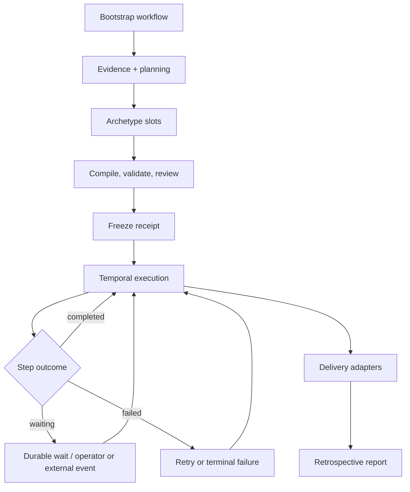

# Tasker architecture

Tasker is a local-first operator console for task-adaptive coding-agent workflows: it
turns a Jira task and repository evidence into a validated, frozen workflow, executes
that workflow through Temporal, and preserves the evidence an operator needs to act.

## One task, end to end

1. **Bootstrap.** `bootstrapWorkflowV3` prepares a managed Git workspace, assembles the
   task and repository context, collects an Evidence Bundle, and can run bounded
   bootstrap investigation steps.
2. **Planning.** The implementation planner returns a typed plan and selects a code-owned
   archetype. `deliver-pr` accepts optional `dependency_await`/`translations` segments and a
   validation profile; `research` accepts bounded investigation questions and resolves its
   product from the Jira project. Deterministic scaffold materialization fills those slots;
   the planner does not own topology.
3. **Freeze.** The candidate is compiled, obligation- and capability-validated, may
   pass plan review, and is persisted with its hashes and references by
   `WorkflowFreezeStore`. The execution input contains only the frozen graph and
   opaque context references.
4. **Execution.** `executionWorkflowV2` walks sequences, bounded loops, steps, and
   finalizers. The normal agent envelope has `completed`, `waiting`, and `failed`
   outcomes; `workflow_change` is an explicit continuation-control outcome. A claim is
   not a receipt: `claims.ts`, transcripts, evidence, and output artifacts provide the
   independently persisted proof used before a graph transition. `waiting` is durable
   state, not a failed attempt.
5. **Delivery.** `deliver-pr` runs validation, verification, review, preparation, and
   pull-request delivery. `research` drafts and agent-reviews the СА, waits for operator
   document approval before publication, then reconciles the Confluence page and files its
   proposed Jira tasks under that same approval. External adapters return typed completion,
   wait, or failure results.
6. **Retrospective.** The execution retrospective activity computes per-step attempts,
   waits, tokens, duration, cost, findings, and proposed follow-up changes; the report
   is stored and surfaced by the operator API.

## Repository map

- `src/kernel/` — Temporal workflows, clients, worker bootstrap, and execution contracts.
- `src/graph/` — workflow schemas, semantic compilation, validation, IR, and archetypes.
- `src/planning/` — evidence assembly, planner prompts, slot schemas, and correction loops.
- `src/steps/` — activities, block execution, evidence, verdicts, receipts, and invocations.
- `src/agents/` — CLI providers, stream parsing, profiles, skills, usage, and cost.
- `src/workspace/` — Git worktrees, repository catalog, Docker runtime, and harness materialization.
- `src/integrations/` — Jira, Bitbucket, Jenkins, Nexus, delivery, and task-scoped adapters.
- `src/store/` — SQLite schema, migrations, repositories, checksums, and persistence.
- `src/server/` — Fastify operator API, projections, planning services, and retrospectives.
- `src/ui/` — TanStack Query cockpit, small components, and SSE realtime updates.
- `src/shared/` — canonical JSON, clock, IDs, outcomes, environment, and small helpers.
- `harness/` — file-backed company, product, step, policy, project, prompt, and workspace guidance.

## SQLite schema

Fresh databases finish migrations with eight persisted tables:

- `schema_metadata` — schema-family and baseline metadata.
- `schema_migrations` — applied migration versions, names, checksums, and timestamps.
- `artifacts` — immutable JSON artifacts with kind, checksum, metadata, and parent links.
- `transcripts` — ordered stdout/stderr chunks for task operations.
- `receipts` — task-scoped block verdict payloads keyed by workflow, node, and attempt.
- `agent_invocations` — rendered prompt, argv, model/profile, usage, cost, and timings.
- `stream_events` — append-only operator stream events with a cursor sequence.
- `documents` — revisioned low-volume domain records keyed by kind and ID.

The old event, projection, aggregate-head, and snapshot tables are created only by the
baseline migration and dropped by the domain-store migration; they are not part of the
fresh final schema.

## Extension points

| Need | Edit |
| --- | --- |
| New step | Add `harness/steps/<name>/step.json` and its prompt; add the runtime contract or adapter in `src/harness/`, `src/steps/`, or `src/integrations/` as its executor requires. |
| New archetype | Add a scaffold under `src/graph/archetypes/`, export it, and extend the planning decision/schema and deterministic materialization path. |
| New product | Add a validated manifest under `harness/products/`; Jira project keys select products server-side. |
| New provider | Implement the provider/parser contract in `src/agents/`, register it in the provider surface, and add corpus fixtures under `test/contract/providers/`. |
| New subagent role | Add the role markdown under `harness/workspace/agents/`, then add matching Claude/Codex entries to `harness/company.json` and `models.env`. |
| Model routing | Edit `harness/company.json` execution profiles and `executionProfileRouting`; keep project overrides in `harness/projects/*/project.json`. |
