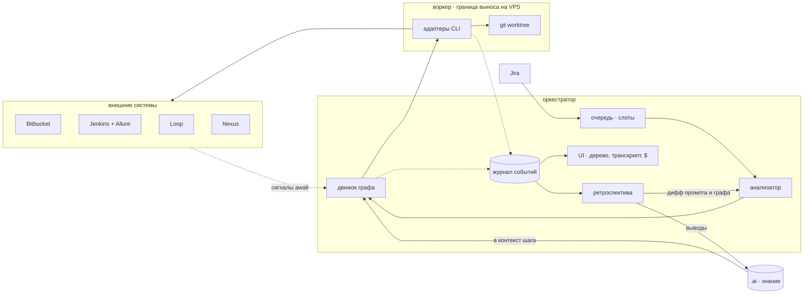
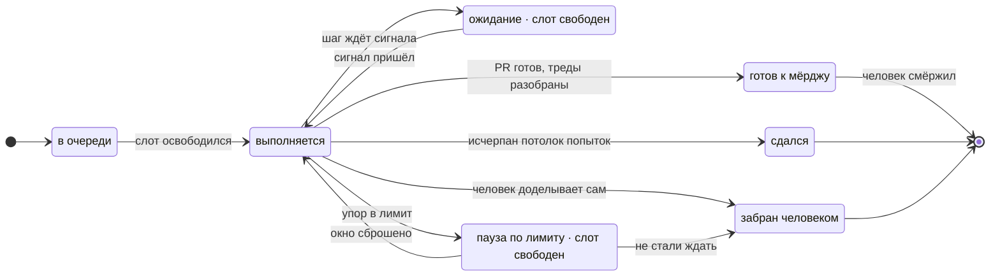
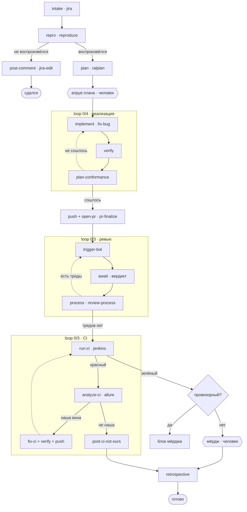
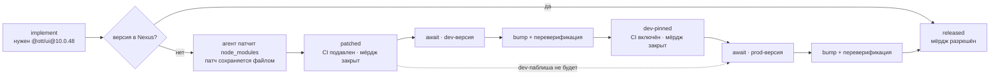

# Схема работы harness

Пять видов на одну систему. Отражает решения из [spec.md](spec.md) и [research-landscape.md](research-landscape.md).

Интерактивная версия с той же схемой: https://claude.ai/code/artifact/4619f394-eb96-486c-93ad-e1ca9250bc11 — приватная, открывается только после шаринга.

Опорные факты: режим **фабрика** (человек-диспетчер), агент делает **всё до мёрджа**, v1 **локально**, агенты **по подписке**.

---

## Вид первый — архитектура

Задача приходит из Jira, анализатор собирает под неё граф, движок его исполняет, адаптеры запускают CLI-агентов в git worktree. Всё произошедшее падает в журнал событий — единственную систему правды, из которой кормятся и живой UI, и ретроспектива.

Граница **оркестратор ↔ воркер** проведена намеренно: сейчас обе стороны на одной машине, но вынести воркеры на VPS позже должно быть переездом, а не переписыванием.

Сплошные стрелки — управление и данные, пунктир — события и сигналы ожидания. Ретроспектива замыкает контур: правит промпты и граф на входе, копит знание о проекте на выходе.

> **Журнал — не лог, а система правды.** Из него строится и живое дерево в UI, и реплей транскрипта завершённого шага, и ретро-отчёт. Пишется: base SHA, снапшот задачи, весь tool-I/O, стоимость и длительность каждой попытки, финальный дифф.

---

## Вид второй — жизненный цикл прогона

Два состояния, `ожидание` и `пауза`, не занимают слот очереди и не считаются активным временем. Без этого разделения три заблокированные задачи съедят половину параллелизма, ничего не делая, а метрика пропускной способности начнёт врать.

Упор в лимит подписки детектируется **постфактум по ошибке** — ни один CLI не отдаёт остаток квоты программно, предварительная проверка невозможна. Переход `выполняется → готов` закрыт, пока прогон помечен провизорным.

---

## Вид третий — собранный граф задачи типа «баг»

Анализатор берёт шаблон по типу задачи и правит его под специфику; человек видит дифф от шаблона и может вмешаться. Узел — это пара `имя · тип шага`, один тип переиспользуется под разными именами: `verify` встречается и в реализации, и в починке CI — это один и тот же код с разным контекстом.

Ромбы — условные ветки `when`. Рамки — группы `loop N/M` с собственным потолком попыток и суммой стоимости. Шестиугольники — гейты человека. **Ветки капитуляции спроектированы явно**: система не зависает молча, она оставляет коммент и останавливается.

**Библиотека типов шагов.** Большая часть уже существует как скиллы: `reproduce`, `fix-bug`, `investigate-bug`, `review-process`, `pr-finalize`, `jira`, `bitbucket`, `jenkins`, `loop`. Не хватает движка, а не шагов.

**Стоимость на трёх уровнях.** На узле, на каждой отдельной попытке внутри цикла и суммой на группе. Claude Code отдаёт доллары готовыми, Codex и Antigravity — только токены, доллары считает харнесс по прайс-таблице.

---

## Вид четвёртый — блокер по версии пакета

Задача упирается в неопубликованную версию `@ott/*` из front-core-packages. Это не одно состояние «жду», а движение по трём — с разной степенью доверия к тому, что получилось.

Гейт стоит **на артефакте в Nexus**, а не на Jira-линке «is blocked by»: линк ставится не всегда, снимается ещё реже и ничего не знает о том, опубликована ли версия. Поскольку в `.npmrc` стоит `save-exact`, предикат ожидания точен до версии — один запрос к метаданным реестра.

Оба шага `bump + переверификация` — один и тот же тип, вызванный дважды с разными параметрами: дождись артефакт, подними версию, переверифицируй. Пунктир — маршрут, когда dev-паблиша не будет вовсе.

| Состояние | Что в репозитории | Чему можно верить |
|---|---|---|
| `patched` | Старая версия в `package.json`, `node_modules` пропатчен агентом | Ничему. Код написан против API, которого нет нигде, кроме этого worktree |
| `dev-pinned` | Реальная dev-версия из Nexus, `package.json` обновлён | Код проверен против настоящего артефакта, но версия нерелизная |
| `released` | Прод-версия | Всему. Мёрдж открыт |

> **Почему CI подавляется в состоянии `patched`.** Патч живёт только в локальном `node_modules` — сборка на Jenkins ставит зависимости из Nexus, получает старую версию и падает на компиляции. Без явного подавления цикл `run-ci → analyze-ci → fix-ci` сожжёт три попытки, чиня то, что не сломано, и с большой вероятностью «починит» правильный код под старый API. Ветка `post-ci-not-ours` здесь не спасает: провал выглядит как ошибка в собственном коде.

---

## Вид пятый — один примитив, пять источников

Ожидание перевода, зелёного билда, вердикта бота, апрува и публикации версии — это не пять механизмов, а один тип шага с разными адаптерами сигнала. Каждый обязан пережить перезапуск процесса.

| Чего ждём | Источник сигнала | Чем кончается ожидание |
|---|---|---|
| Публикация версии пакета | Nexus | Версия появилась в метаданных реестра |
| Готовность переводов | Loop | Пост переводчика в канале |
| Результат сборки | Jenkins + Allure | Билд завершился, отчёт доступен |
| Вердикт бота-ревьюера | Bitbucket | Треды появились или PR остался чист |
| Решение человека | UI | Апрув плана, правка промпта, мёрдж |

### Где стоит человек

- **Апрув плана** — до того, как начнётся реализация. Гейт отключаемый: доверие к типу задачи растёт, гейт снимается.
- **Правка промпта** — перед запуском любого следующего шага, не дожидаясь провала.
- **Мёрдж** — всегда. Единственная точка, которую нельзя автоматизировать.
- **Разбор тупика** — прогон в состоянии «сдался» ждёт решения: переиграть, забрать руками или закрыть.

### Что за границей системы

Публикация версий `@ott/*` в Nexus — релизное действие с последствиями для семи репозиториев, остаётся человеку и CI. Автоматический мёрдж и закрытие задачи в Jira — не делаем. Межзадачный DAG в шедулере — не строим, артефактный `await` решает ту же задачу и работает даже когда блокер делает чужая команда. Эталонный набор задач и грейдер выведены из скоупа отдельным решением; проверка правок промптов идёт по тренду метрик, версионированию и откату.
