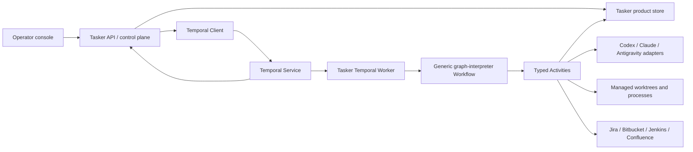

# Tasker architecture

Status: canonical target architecture, Temporal revision, 2026-08-03

## 1. Product boundary

Tasker is a personal operator console and task-adaptive coding harness. It is not a
general durable-execution platform. Temporal provides durable execution; Tasker adds
the domain that makes a Jira task become a reviewable coding workflow.

The target user journey is:

```text
backlog -> intake -> repository checkout -> workflow assembly -> implementation plan
        -> execution/recovery -> CI -> human code review -> revise -> waiting/done
```

The operator normally intervenes only to:

1. answer a genuinely blocking question;
2. approve or revise the implementation plan when plan review was requested;
3. guide an agent that explicitly asks for help after bounded recovery;
4. review the PR and send comments back for revision;
5. complete a human-only gate such as translation or final package publication.

No task is silently discarded because a process, worker, laptop, VPN, provider, or
remote API failed. Resumption continues from the failed boundary and keeps the
worktree, completed activities, artifacts, and operator decisions.

## 2. Ownership model

### Tasker owns

- normalized task, repository, and linked-context intake;
- the versioned workflow IR and block catalog;
- company/project policy, prompts, skills, and mandatory obligations;
- read-only analyzer input and untrusted graph proposal generation;
- deterministic graph validation;
- provider selection and subscription-CLI invocation;
- worktree lifecycle and all Jira/Bitbucket/Jenkins/Confluence adapters;
- external-effect safety, idempotency keys, reconciliation, and receipts;
- operator projections, transcripts, artifacts, measured usage, shadow cost, and
  retrospective data.

### Temporal owns

- canonical execution history and current workflow position;
- task queues and worker delivery;
- timers, retry scheduling, cancellation, and timeout state;
- crash/restart recovery and activity heartbeats;
- durable waits, signals, synchronous operator updates, and workflow queries;
- workflow/child-workflow coordination;
- worker deployment compatibility and replay safety.

Tasker must not rebuild Temporal's ready set, runner leases, fence tokens, execution
cursor, wait table, retry timer, or scheduler. SQLite remains a product store, not a
second execution authority.

## 3. System shape



The Temporal Service may run locally for the personal workflow or on a VPS. A worker
runs where it can access the relevant managed checkout. Task queues express worker
capability and location; they are not project-specific business logic.

## 4. Task admission and repository binding

Jira is the default task source, not a hard-coded kernel dependency. A tracker adapter
produces a normalized immutable task snapshot. Repository resolution follows this
precedence:

1. an explicit repository chosen while creating/importing the Tasker task;
2. a future dedicated Jira repository field;
3. `repo:<repository-name>` in the Jira description;
4. otherwise `repository_mapping_required` and no workflow generation.

Repositories are cloned into Tasker's application-data directory, never into
`~/Projects/work`. Existing operator clones may be discovered for naming help but are
not mutated. Before planning, Tasker creates a managed branch/worktree and runs the
configured external harness bootstrap. Its locator and bootstrap receipt are product
artifacts recorded by the preparation Activity and referenced by durable Workflow
state. The API request contains portable task/graph/settings data; it does not perform
runner-local filesystem work before Temporal starts.

Repeated Jira synchronization updates the cached snapshot and `syncedAt`; it does not
append activity-log noise. A VPN/403/network failure changes sync health only. It does
not invalidate the cached task, delete a workflow, or restart completed work.

## 5. Per-task workflow assembly

Every task receives a newly assembled graph. There is no default bugfix, feature,
translation, or PR template.

Assembly input is a bounded, provenance-bearing planner context:

- normalized task snapshot, comments, attachment metadata, and linked context;
- repository identity, bounded read-only repository evidence, and worktree locator;
- global company policy and project-specific workflow policy;
- registered block catalog with typed input/output/effect contracts;
- mandatory obligations and safety constraints;
- exact prompt, skill, policy, and analyzer versions/hashes.

The analyzer emits untrusted `WorkflowSource` JSON. A deterministic compiler parses,
canonicalizes, validates, and hashes it. The compiler may reject a graph but never
silently insert missing nodes; otherwise the UI's “why this workflow” provenance would
be false.

Examples of deterministic obligations:

- bug paths contain before and after reproduction evidence;
- a write path verifies after implementation;
- a PR path observes CI and reaches human code review;
- every loop and retry budget is bounded;
- every effect has the required capability and reconciliation policy;
- terminal paths end in an allowed final state or explicit durable wait.

The accepted compiled graph, run policy, and hashes become immutable Temporal Workflow
input. Large prompts, repository snapshots, transcripts, videos, and screenshots stay
in the Tasker artifact store; history contains stable IDs, hashes, metadata, and bounded
summaries. Secrets never enter Workflow input or Event History.

## 6. Generic Temporal graph interpreter

Tasker does not generate and deploy TypeScript Workflow code per Jira task. One stable,
versioned Temporal Workflow interprets the compiled graph:

```text
TaskWorkflow(compiledGraph, runPolicy, artifactReferences)
```

The interpreter is deterministic. It may inspect only its input, prior Activity
results, messages, and Workflow state. It must not read the filesystem, call an LLM,
query Jira, access a database, use wall-clock APIs outside Temporal, or generate random
values outside Temporal primitives.

Node mapping:

| Tasker graph concept | Temporal implementation |
|---|---|
| `agent` step | Activity using a provider adapter and versioned prompt/skills |
| `process` step | Activity using a registered command executor |
| `integration` step | prepare/execute/reconcile Activities |
| sequence | deterministic interpreter transition |
| branch | deterministic predicate over recorded data |
| bounded loop | deterministic interpreter counter and condition |
| retry/backoff | Activity Retry Policy or explicit Workflow timer when domain decisions are required |
| blocking question | Workflow Update/Signal plus `condition` |
| plan approval/revision | validated Workflow Update plus `condition` |
| CI/review/translation event | Signal; poll Activity is recovery fallback |
| long human wait | `condition` with optional durable timer/escalation |
| independent linked work | Child Workflow where it has its own repo/resource/lifecycle |

Queries expose the current public interpreter state to the console. Updates are used
when the operator needs immediate accepted/rejected feedback. Signals are used for
asynchronous notifications where a caller does not need a synchronous result.

## 7. Activities and block contracts

A registered block has a stable versioned reference and one execution kind:

- `agent`: a prompt, logical skills, allowed tools, structured input/output, and
  provider policy;
- `process`: a policy-owned command or process adapter, never arbitrary shell from the
  generated graph;
- `integration`: a typed external adapter with prepare/execute/reconcile behavior.

Process commands are policy data, not interpreter branches. Company-wide commands live
in `harness/company.json`; repository-specific overrides live in
`harness/projects/*/project.json`. The resolved command, executor, and harness checksum
are copied into the immutable planning snapshot before execution. Adding translations,
a build, or `fill-test-ops-plan` does not add a `switch` to Temporal Workflow code.

Each block declares:

- Zod input/output schemas;
- required capabilities and permitted effects;
- timeout, heartbeat, cancellation, and retry policy;
- idempotency/reconciliation behavior;
- produced artifact kinds;
- permitted outcomes, including `question`, `workflow_change_required`, `blocked`, and
  `completed`.

Activities may be non-deterministic. They must be independently retryable at their
declared boundary and persist useful evidence before returning. Long CLI calls
heartbeat with a stable attempt/artifact reference. Cancellation requests terminate
the managed subprocess where possible and record whether termination was confirmed.

Temporal delivery does not make a Jira comment, git push, package publish, or PR update
exactly once. External mutations use a Tasker idempotency key and this protocol:

```text
prepare intent -> inspect/reconcile prior state -> execute if safe -> persist receipt
```

If an Activity crashes after a request but before its receipt, the next attempt
reconciles the remote system before deciding whether to repeat. `unknown` is a durable
operator-visible state, not permission to retry blindly.

## 8. Planning and questions

An implementation plan is always created after graph assembly and early repository
analysis. `planReviewRequired` is chosen when starting the task:

- `false`: an accepted plan proceeds automatically;
- `true`: the Workflow waits for operator approval or revision.

Both modes stop for a blocking question. “No plan review” does not authorize the agent
to invent a product decision it says it cannot make safely. A question carries the
decision needed, evidence, options, recommendation, impact of no answer, and whether a
safe default exists.

Plan size is selected by deterministic heuristics plus planner evidence:

- small plan for bounded, local, low-risk changes;
- normal plan for multi-surface or uncertain work;
- consensus/`ralplan` only for high ambiguity, cross-repo/publication work, or explicit
  operator choice.

The operator may send plan feedback. That creates a new immutable planning Activity
attempt; it does not edit previous history. Harness/prompt edits affect later attempts
only when explicitly selected and otherwise affect future runs.

## 9. Runtime discovery and graph evolution

Initial assembly cannot know everything. Reproduction or implementation may discover
a shared component in another repository, an external translation process, new visual
verification, or a missing human publication gate.

A step returns typed `workflow_change_required` with evidence and proposed intent. It
does not mutate the accepted graph. The parent Workflow:

1. preserves completed history and artifacts;
2. calls a planning Activity for a continuation proposal;
3. validates and hashes the proposed revision;
4. automatically accepts it when policy allows, or waits for review during the pilot;
5. starts the accepted continuation as a Child Workflow with its own immutable graph,
   even when it shares a repository, so the accepted parent graph never mutates;
6. resumes the parent only from the join boundary.

During stabilization, every graph revision is operator-reviewable. Once retrospective
evidence shows a class is reliable, policy may auto-accept that class. The validator is
always mandatory.

Completed nodes never re-run merely because the graph changed. A 403 during push, a
sleeping laptop, a worker restart, or a missing translation signal resumes the pending
Activity/wait, not the Jira task from intake.

## 10. Human and external waits

Waits are first-class domain states projected from Temporal history:

- `clarification_required`;
- `plan_review`;
- `agent_guidance_required` after bounded recovery;
- `translation_pending`;
- `dev_publish_pending` or `final_publish_pending`;
- `ci_pending`;
- `code_review_pending`;
- `infrastructure_blocked`;
- `external_effect_unknown`.

Every wait declares the expected message, optional timeout/escalation, and resume
payload schema. The Workflow consumes a message once and records the decision in
history. Duplicate webhook/poll results are deduplicated by stable external identity.

PR conversation is the primary review channel: Tasker imports unresolved Bitbucket
threads, starts a revision Activity, posts or resolves only through the integration
adapter, waits for CI again when needed, and returns to code review. The cockpit may
also submit operator guidance. For an infrastructure or agent block, that guidance
resumes the same durable wait and is included in the next attempt; the completed
prefix, worktree, artifacts, and conversation provenance remain intact.

## 11. CI and evidence

CI is part of every PR workflow. After push/PR preparation, Tasker observes Jenkins and
classifies failures:

- success -> code review wait;
- likely flaky/infrastructure -> bounded retry or operator-visible infra wait;
- attributable to the change -> revision loop;
- unknown -> diagnostic Activity, then question or guidance wait after its budget.

Verification scope is task-specific. Project policy and changed-surface evidence may
select build-only, targeted tests, full validation, Allure inspection, before/after
reproduction, or screenshot snapshot updates. A bug without usable Jira reproduction
must attempt reproduction; successful “before” video/screenshots become linked Tasker
artifacts and may be attached/commented to Jira only through explicit effect policy.

## 12. Operator console and observability

The console remains a three-pane operational surface:

- left: tasks, lifecycle state, attention/wait indicator, elapsed time, and shadow cost;
- center: selected Activity/agent stream, decisions, artifacts, plan, Jira details,
  questions, review comments, and compact errors;
- right: the current graph/revision, active node, retry/loop budget, waits, child runs,
  and completion state.

The UI is a projection, never execution authority. Runtime status comes from Temporal
Workflow state/history and Search Attributes. Tasker SQLite stores product metadata,
cached Jira data, graph rationale, transcripts, artifacts, usage, shadow cost,
retrospective annotations, and UI-friendly indexes.

Routine sync successes and failures do not grow the activity timeline. Operational
logs are redacted, bounded, and separate from agent/task activity. Temporal Event
History is not used as a transcript store.

Time and cost are attributed per Activity attempt:

- queue delay, execution time, wait time, and operator time;
- measured provider tokens when available;
- provider/model and a versioned API price table for hypothetical cost;
- process/integration duration and retry count.

## 13. Deployment and concurrency

The first supported topology is single-user:

- Temporal development/self-hosted service on the laptop for local evaluation;
- Tasker API/cockpit and one or more workers;
- application data and managed repositories under an OS-standard Tasker data path.

A VPS deployment moves the Temporal Service/control plane and eligible workers without
changing Workflow semantics. Filesystem Activities must run on a worker that owns or
can access the checkout. Multiple Jira tasks execute concurrently according to Worker
concurrency, Task Queue routing, and provider quota policy; they never share a global
UI “generating” flag.

`temporal server start-dev` is acceptable for development, not a production durability
claim. Before relying on unattended VPS execution, the deployment must use a supported
persistent Temporal topology or Temporal Cloud, backups, TLS/authentication, and a
tested worker deployment strategy.

## 14. Versioning and security

The compiled graph has an IR ABI version; each block and prompt has its own version/hash.
Temporal Workflow changes use Worker Versioning and replay-compatibility tests. An old
run remains executable by a compatible worker build until it reaches a safe boundary.

Secrets exist only in worker process configuration and Activity adapters. They are
redacted before Tasker persistence and never passed in Workflow arguments, results,
Search Attributes, logs, or artifact metadata. Integration capabilities are
fail-closed; an analyzer cannot grant itself a Jira/Bitbucket/publish capability.

## 15. Architectural invariants

1. Every initial graph is assembled specifically for its task.
2. Generated graph data is untrusted until deterministic validation succeeds.
3. Temporal is the only execution-history authority.
4. Tasker product storage never decides which node executes next.
5. Workflow code is deterministic; all I/O and LLM work occurs in Activities.
6. Completed work survives worker/process/host interruption.
7. External mutations are idempotent or reconciled before retry.
8. Human waits consume no worker slot.
9. Blocking uncertainty becomes a question, not an invented decision.
10. Active graphs and plans are immutable; revisions create recorded new versions.
11. Prompts, skills, blocks, policies, providers, and integrations are readable and
    replaceable without rewriting the interpreter.
12. Company-specific names and vendor payloads do not enter the Workflow domain.
13. Large/sensitive artifacts stay outside Temporal history.
14. Retrospective recommendations never modify the harness automatically.

## 16. Decision record

Decision: use Temporal as Tasker's durable execution kernel and retain Tasker's dynamic
graph compiler/interpreter and product control plane.

Why: durable waits, restart recovery, retry timers, messaging, task queues, workflow
coordination, and worker versioning are established infrastructure. Reimplementing them
does not differentiate Tasker and creates correctness/maintenance risk.

Rejected:

- continue the custom SQLite scheduler/lease/cursor kernel: already proven useful for
  discovery, but its infrastructure burden grows faster than product behavior;
- generate TypeScript Workflow code for each task: deployment/versioning overhead and
  unsafe dynamic code; a generic interpreter preserves task-specific graphs as data;
- use both Temporal and the custom ledger as execution authorities: ambiguous recovery
  and double-history bugs;
- put LLM planning inside Workflow code: non-deterministic and unreplayable;
- adopt Effect/LangGraph as another control-flow runtime: they do not replace Temporal
  durability and are unnecessary for the current block/IR boundary.

Migration and deletion gates are defined in
[`temporal-migration.md`](temporal-migration.md).
