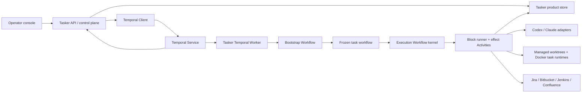

# Tasker architecture

Status: canonical architecture, 2026-08-13

## 1. Product boundary

Tasker is a personal operator console and task-adaptive coding harness. It is not a
general durable-execution platform. Temporal provides durable execution; Tasker adds
the domain that makes a Jira task become a reviewable coding workflow.

The target user journey is:

```text
backlog -> intake -> repository checkout -> workflow assembly -> implementation plan
        -> execution/recovery -> CI -> human code review -> revise -> waiting/done
```

The operator normally intervenes only to:

1. answer a genuinely blocking question;
2. approve or revise the implementation plan when plan review was requested;
3. guide an agent that explicitly asks for help after bounded recovery;
4. review the PR and send comments back for revision;
5. complete a human-only gate such as translation or final package publication.

No task is silently discarded because a process, worker, laptop, VPN, provider, or
remote API failed. Resumption continues from the failed boundary and keeps the
worktree, completed activities, artifacts, and operator decisions.

## 2. Ownership model

### Tasker owns

- normalized task, repository, and linked-context intake;
- the versioned workflow IR and block catalog;
- company/project policy, prompts, skills, and mandatory obligations;
- read-only analyzer input and untrusted graph proposal generation;
- deterministic graph validation;
- provider selection and subscription-CLI invocation;
- worktree lifecycle and all Jira/Bitbucket/Jenkins/Confluence adapters;
- external-effect safety, idempotency keys, reconciliation, and receipts;
- operator projections, transcripts, artifacts, measured usage, shadow cost, and
  retrospective data.

### Temporal owns

- canonical execution history and current workflow position;
- task queues and worker delivery;
- timers, retry scheduling, cancellation, and timeout state;
- crash/restart recovery and activity heartbeats;
- durable waits, signals, synchronous operator updates, and workflow queries;
- workflow/child-workflow coordination;
- worker deployment compatibility and replay safety.

Tasker must not rebuild Temporal's ready set, runner leases, fence tokens, execution
cursor, wait table, retry timer, or scheduler. SQLite remains a product store, not a
second execution authority.

The production block catalog has one owner: `harness/steps/<step>/step.json`. An agent
step keeps its `prompt.md` in the same directory. A manifest declares the step identity,
operator stage, executor, prompt and skills, terminal condition, effects, artifacts, and
recovery boundary. `src/harness/step-contracts.ts` is only the typed runtime ABI for the
named input/output contracts used by those manifests; it cannot register an executable
step. Activities and integration adapters implement the executor names selected by
manifests, while the generic Workflow interpreter only moves through the frozen graph.

## 3. System shape



The Temporal Service may run locally for the personal workflow or on a VPS. A worker
runs where it can access the relevant managed checkout. Task queues express worker
capability and location; they are not project-specific business logic.

## 4. Task admission and repository binding

Jira is the default task source, not a hard-coded kernel dependency. A tracker adapter
produces a normalized immutable task snapshot. Repository resolution follows this
precedence:

1. an explicit repository chosen while creating/importing the Tasker task;
2. a future dedicated Jira repository field;
3. `repo:<repository-name>` in the Jira description;
4. otherwise `repository_mapping_required` and no workflow generation.

Repositories are cloned into Tasker's application-data directory, never into
`~/Projects/work`. Existing operator clones may be discovered for naming help but are
not mutated. Before implementation planning, Tasker creates a managed branch/worktree,
materializes the pinned harness profile, and prepares its Docker runtime. Its locator,
harness receipt, and Docker receipt are product artifacts recorded by the preparation
Activity. Durable Workflow state receives only a bounded workspace handle: workspace
ID, repository reference, revision, and path. It does not contain bootstrap manifests,
Docker environment, command output, or provider receipts. The API request contains only
the task reference and immutable run settings. It does not contain a graph/hash and does
not perform runner-local filesystem work before Temporal starts.

Repeated Jira synchronization updates the cached snapshot and `syncedAt`; it does not
append activity-log noise. A VPN/403/network failure changes sync health only. It does
not invalidate the cached task, delete a workflow, or restart completed work.

At bootstrap, the normalized task-source subject is captured under the exact Temporal
`runId`. Retries and process restarts of that run reuse the capture. A later run of the
same Jira task resolves and captures a fresh source revision instead of inheriting the
previous run's task snapshot.

## 5. Context, planning, candidate validation, and freeze

Every task receives a newly assembled semantic workflow. There is no default bugfix,
feature, translation, or PR template. The semantic workflow is the planner- and
operator-facing domain artifact; the compiled Temporal execution IR is a separate
deterministic artifact and is never presented as the task workflow.

The canonical lifecycle is `bootstrap run -> graph-free planning context -> semantic
planner candidate -> deterministic compilation -> frozen execution workflow`; see
[`planning-lifecycle.md`](planning-lifecycle.md). Bootstrap is a durable infrastructure
protocol, not a reusable business graph. Context discovery creates an append-only
Evidence Bundle. The mandatory planner may select bounded pre-plan investigation and
then produces the first complete task-specific workflow candidate before product
effects begin.

Assembly input is a bounded, provenance-bearing planner context:

- normalized task snapshot, comments, attachment metadata, and linked context;
- repository identity, bounded read-only repository evidence, and worktree locator;
- global company policy and project-specific workflow policy;
- registered block catalog with typed input/output/effect contracts;
- mandatory obligations and safety constraints;
- exact prompt, skill, policy, and provider-profile versions/hashes.

The planner's `ready` decision emits untrusted `SemanticWorkflowSource` JSON together with the
implementation plan and optional follow-ups. Every acceptance criterion declares an
observable expected result plus typed verification (`automated_test`, `process`,
`runtime_evidence`, or `inspection`) and references the semantic Verify work that will
prove it. A new automated test is an explicit planning choice and remains part of
implementation; Tasker does not insert a universal test-materialization step. A
deterministic boundary rejects references absent from the same candidate, then the
compiler parses, canonicalizes, validates, hashes, and lowers the semantic source to a
separate executable IR. The compiler may expand only the internal protocol declared by a
selected registered block. It may not insert an unselected semantic step; otherwise the
UI's “why this workflow” provenance would be false.

Examples of deterministic obligations:

- a write path verifies after implementation;
- a PR path observes CI and reaches human code review;
- every planner-visible semantic loop is explicit and bounded;
- every effect has the required capability and reconciliation policy;
- terminal paths end in an allowed final state or explicit durable wait.

Policy applicability is task-origin data, not a vendor branch in the compiler. A
tracker policy configures bootstrap admission and Delivery operations only for tasks from that
tracker; neither operation becomes a planner-visible block. Effect selectors protect future
semantic blocks without enumerating their names. Jira
does not receive Tasker's private before-reproduction evidence automatically; final
demo evidence may be published during delivery when the task policy requests it.
These obligations add no vendor branches to the compiler or Temporal Workflow.

Jira remains the source of truth for transition prerequisites. Before either admission
or review-ready mutation, its adapter reads `transitions.fields` and the current values
of required fields without defaults. Missing fields open an actionable durable wait
before a mutation intent is created. The operator fills the field (or performs an
intentionally human-only transition) and resumes the same block; the completed graph
prefix, worktree, PR, and CI evidence are preserved. Tasker never invents estimates or
other business values. Jira validators may still reject a transition after preflight;
structured 400 reasons remain visible in the same operator action.

The review-ready adapter owns one Tasker-managed PR comment per Jira issue. Its
configured prefix is the stable remote identity: a later run updates that comment with
the current PR link instead of appending another one. An existing non-Tasker comment
that already contains the exact PR URL is accepted without rewriting human text. More
than one comment with the managed prefix is a remote conflict; Tasker stops instead of
choosing or deleting a comment silently.

The first semantic candidate and its compiled IR are not yet executable or immutable. Validation rejection
persists exact feedback plus the rejected `ready` decision and asks the planner for a
complete replacement candidate. Tasker never patches accepted semantic source or
compiled IR silently.

Bootstrap v3 is the only bootstrap runtime. The previous bootstrap implementation,
precompiled-graph generation path, workflow IDs, and tests are deleted rather than
supported in parallel.

The exact module and dependency map is documented in
[`technical-architecture.md`](technical-architecture.md). In particular, the durable
core imports neither the control plane nor tracker/SCM/CI adapters; only the API and
worker composition roots choose concrete external systems.
After the plan fits and optional operator review succeeds, the accepted semantic source,
compiled IR, run policy, and hashes become frozen only after Tasker persists an immutable
receipt containing the task/run identity, semantic hash, executable hash, compiler
version, planning artifact and attempt, Evidence Bundle snapshot, approval mode, and
timestamp. The receipt operation
is idempotent: Activity redelivery returns the exact prior receipt, while a conflicting
hash for the same run fails closed. Until receipt persistence succeeds, the public run
remains `draft`; exhausted infrastructure retries open a durable operator wait and keep
the same worktree. Large prompts, repository
snapshots, transcripts, videos, and screenshots stay
in the Tasker artifact store; history contains stable IDs, hashes, metadata, and bounded
summaries. Secrets never enter Workflow input or Event History.

### 5.1 Run isolation

`taskReference` is a business identity used to start the current Temporal lifecycle and
group historical runs. It is never a storage key for mutable run state. Every mutable
artifact is addressed by the identity of the run boundary that created it:

- Bootstrap and Execution state: exact Temporal `workflowId` and `runId`;
- planning records, transcripts, questions, and plan reviews: `planningEpisodeId`, which
  contains the Bootstrap `runId`;
- workflow proposals, compiled graphs, validator reports, and analyzer receipts:
  `workflowOperationId` from that planning episode;
- planning/investigation evidence: an explicit operation scope and append-only bundle
  revision;
- freeze receipts: exact Bootstrap workflow/run pair;
- execution receipts, evidence, reviews, and transcripts: exact Execution workflow/run;
- continuations: exact Execution `runId`, with a distinct candidate/attempt identity
  derived from it.

The control plane first asks Temporal for the current lifecycle and then follows only
the exact identifiers exposed by that lifecycle. There is no `latest by task`, fallback
to a task projection, or scan that substitutes an artifact from another run. A missing
artifact for the current identifier fails closed even when an older run of the same Jira
task has a valid artifact. Jira snapshots and repository catalog entries are shared
source data; a run consumes only the immutable snapshots captured into its own planning
context.

`Restart from scratch` therefore creates a new isolation domain: new Bootstrap `runId`,
workspace, planning episode, evidence scope, workflow operation, freeze receipt,
Execution workflow, reviews, and continuations. The terminated run remains queryable as
history, but none of its mutable artifacts can become current state for the replacement.

### 5.2 Runtime vocabulary

- **Stage** is an operator projection such as Workspace, Investigate, Plan, Development,
  Agent review, Delivery, or Human review. It groups semantic work but is not schedulable.
  Expanding a stage reveals the selected semantic blocks, their attempts, and their
  internal events. A command, integration call, local commit, retry, reconciliation
  probe, receipt validator, compiler container, or unselected outcome is not a task
  step. Planned future stages remain compact headers. Expected Verify, agent-review,
  CI, and human-review feedback paths are frozen as bounded loops and reuse the same
  operator stages when selected; they never appear as duplicated continuation stages.
  Bootstrap stages come from the complete Bootstrap lifecycle; execution stage state
  comes from Execution node state. Attempts, receipts, evidence, and the raw immutable
  graph remain available from the agent/process transcript and diagnostic surfaces.
- **Semantic Block** is a reusable versioned work contract selected into one task
  workflow. It owns inputs, outcomes, completion rules, recovery protocol,
  prompt/skills/profile where relevant, and produced evidence. One agent invocation is
  one operator step. Registered commands and external effects owned by the block appear
  as internal operations with their own receipts.
- **Effect** is one atomic filesystem, Git, tracker, SCM, CI, or other external
  operation with durable intent and receipt. It may be an expandable child of a block
  rather than an operator stage.
- **Agent Episode** is one provider-neutral reasoning session for an agent block. It
  may propose content, request allowed mediated effects, ask a question, or return a
  candidate result; it cannot declare authoritative completion.

### 5.3 Semantic source and executable IR

The semantic source answers what this task will do and why. For a simple bug it is
expected to remain close to:

```text
Investigate -> Plan -> Development loop (Implement + Verify)
-> Agent review -> Pull request delivery -> Human review
```

The executable IR answers how Temporal resumes exact operations. It may contain pure
interpreter mechanics or references to block-owned internal protocols, but those details
do not become planner-authored task work. Both artifacts are immutable and linked by the
freeze receipt. The raw executable IR remains downloadable diagnostic evidence.

## 6. Generic Temporal graph interpreter

Tasker does not generate and deploy TypeScript Workflow code per Jira task. One stable,
versioned Temporal Workflow interprets the compiled graph:

```text
ExecutionWorkflow(frozenExecutableIr, semanticWorkflowReference, runSettings, contextReferences)
```

The Bootstrap Workflow owns workspace/context preparation, investigation admission,
mandatory planning, optional plan review, reconciled task-source admission, deterministic draft
validation, and the immutable freeze receipt. Jira admission runs after plan acceptance and before
freeze/Execution, so a 400/403 waits on the same run and worktree without becoming a semantic node.
The Execution Workflow receives only the accepted frozen
executable IR plus opaque semantic/artifact references. It never discovers planning
nodes by name.

Plan approval is the execution boundary, not a second launch gate. After a valid plan
is approved, or immediately after automatic plan acceptance, Bootstrap freezes the
graph and starts the Execution Workflow without an operator `Run` action. Once a task
has entered Bootstrap, its public runtime state obeys this invariant:

- a nonterminal task is executing a real Temporal node and exposes that node plus its
  persisted agent/activity progress;
- or it is in a durable wait whose reason and required operator action are visible;
- only a terminal task may be idle without asking the operator for anything.

The console refreshes the selected running projection while the runtime is active. It
reads the current node from Temporal and the active agent transcript from the durable
ledger. Provider output is appended while the process runs, so commands, messages,
byte counts, and measured token usage survive reloads and worker restarts. The console
does not synthesize progress, animate a timer as evidence, or retain a passive `planned`
state between plan approval and execution. A failed runtime query is an operator-visible
observability failure. Tracker admission is a hidden Bootstrap operation owned by the task-source
policy, not a separate operator stage named `Start work` and not part of the semantic workflow.

The interpreter is deterministic. It may inspect only its input, prior Activity
results, messages, and Workflow state. It must not read the filesystem, call an LLM,
query Jira, access a database, use wall-clock APIs outside Temporal, or generate random
values outside Temporal primitives.

Node mapping:

| Tasker graph concept | Temporal implementation |
|---|---|
| `agent` step | Activity using a provider adapter and versioned prompt/skills |
| `process` step | Activity using a registered command executor |
| `integration` step | prepare/execute/reconcile Activities |
| sequence | deterministic interpreter transition |
| branch | deterministic predicate over recorded data |
| bounded loop | deterministic interpreter counter and condition |
| retry/backoff | Activity Retry Policy or explicit Workflow timer when domain decisions are required |
| blocking question | Workflow Update/Signal plus `condition` |
| plan approval/revision | validated Workflow Update plus `condition` |
| CI/review/translation event | Signal; poll Activity is recovery fallback |
| long human wait | `condition` with optional durable timer/escalation |
| independent linked work | Child Workflow where it has its own repo/resource/lifecycle |

Queries expose the current public interpreter state to the console. Updates are used
when the operator needs immediate accepted/rejected feedback. Signals are used for
asynchronous notifications where a caller does not need a synchronous result.

## 7. Activities and block contracts

A registered semantic block has a stable versioned reference and one primary execution
protocol:

- `agent`: a prompt, logical skills, allowed tools, structured input/output, and provider
  policy;
- `verification`: exact project process operations plus optional runtime/visual agent
  judgment;
- `delivery`: typed Git/tracker/SCM/CI operations with prepare/execute/reconcile behavior;
- task-specific external/human protocols such as translations or package publication.

An internal operation remains typed and independently receipted. Grouping it under a
semantic block does not turn several remote mutations into one unobservable or
unreconcilable Activity.

Logical agent skills are stored once in the pinned workspace harness. An Activity
projects the resolved ambient and bound selection into the active subscription CLI's
temporary discovery layout (`CODEX_HOME/skills` for Codex or an added `.claude/skills`
directory for Claude). The workflow graph and block contract contain no provider paths.
No skill is permanently installed in the managed repository. Scope comes from the
pinned workspace manifest, while project `stepBindings` add repository knowledge only
to named compatible steps.

Process commands are policy data, not interpreter branches. Company-wide commands live
in `harness/company.json`; repository-specific bindings live in
`harness/projects/*/project.json`. The resolved command, executor, and harness checksum
are copied into the immutable planning snapshot before execution. Adding translations,
a build, or `fill-test-ops-plan` does not add a `switch` to Temporal Workflow code.

Each block declares:

- Zod input/output schemas;
- required capabilities and permitted effects;
- timeout, heartbeat, cancellation, and retry policy;
- idempotency/reconciliation behavior;
- produced artifact kinds;
- permitted typed claims, including `candidate_complete`, `needs_input`,
  `workflow_change_required`, `blocked`, and `failed`;
- an authoritative completion evaluator and required evidence/artifact contracts.

Block Definition uses schema v3 and Block Receipt uses schema v4. A block may declare a typed
output-to-predicate mapping: one output discriminator, exact cases, and optional default facts.
After output-schema validation and completion-evidence acceptance, the block runner derives those
facts itself and persists them in the receipt. Provider output cannot write arbitrary workflow
facts.

Agent output is a claim, never execution authority. The block runner validates the
claim schema, resolves actual evidence, runs the block-specific completion evaluator,
reconciles effects, and only then persists an immutable Block Receipt and returns a
terminal block outcome to Temporal. A prose summary or schema-valid result without the
declared evidence cannot complete a block.

The local-ready suffix separates three operator responsibilities:

```text
Implement (one agent attempt, workspace mutation, optional local commits)
-> Verify (exact project operations plus criterion-linked runtime evidence)
-> Agent review (independent typed review)
```

The `quality-boundaries` policy enforces accepted Verify evidence before independent
review and accepted review before Delivery. A reproduced bug binds the investigated
scenario to Verify; it is not a later sibling node that can accidentally run after
review.

A non-zero verification command is accepted as diagnostic operation evidence and maps
to a failed Verify domain verdict; it is neither an Activity failure nor success inferred
from agent prose. The current Development loop advances to another Implement attempt.
Agent-review changes set a typed `repair_required` outcome and repeat the frozen review
feedback loop. Exhaustion opens operator guidance while preserving the same worktree and
completed evidence. It does not invoke the workflow-continuation planner.

Activities may be non-deterministic. They must be independently retryable at their
declared boundary and persist useful evidence before returning. Long CLI calls
heartbeat with a stable attempt/artifact reference. Cancellation requests terminate
the managed subprocess where possible and record whether termination was confirmed.

All workflow analyzers, implementation planners, agent blocks, process blocks,
Playwright runs, builds, tests, and project services execute in Docker. The host/VPS
retains only the control plane: Temporal/API/UI/product storage, managed Git worktree
ownership, Docker daemon control, and typed external-system adapters. There is no host
execution fallback. See [`docker-execution.md`](docker-execution.md).

### 7.1 Execution profiles

Provider bindings are selected only through named execution profiles. A company pack
registers complete Codex and Claude subscription-CLI definitions and routing for
workflow analysis plus `fast`/`ralplan` planning. A project may redirect those routes
and map a logical agent profile such as `implementation` or `review` to another
registered profile. A deterministic task strategy (`simple`, `standard`, or `complex`)
selects a registered route; it never emits a raw model/provider name. An explicit run
override, where policy exposes one, has highest
precedence:

```text
explicit run override -> project redirect -> company route/logical profile
```

Every name must resolve. An unknown profile rejects harness loading or run preparation;
Tasker never silently selects a provider, model, or cheaper planning strategy. The
resolved provider, command, model, effort, timeout, service tier, and canonical
configuration hash are copied into the planning snapshot before freeze. Later config
edits therefore affect only later runs.

Codex and Claude implement the same analyzer, planner, and agent-block contracts. Their
adapters own authentication projection, CLI arguments, structured output, skill
materialization, transcript capture, normalized usage, timeout, cancellation, and
receipt metadata. Adding another provider must add an adapter and registered profile;
it must not add provider branches to the graph or interpreter.

Temporal delivery does not make a Jira comment, git push, package publish, or PR update
exactly once. External mutations use a Tasker idempotency key and this protocol:

```text
prepare intent -> inspect/reconcile prior state -> execute if safe -> persist receipt
```

If an Activity crashes after a request but before its receipt, the next attempt
reconciles the remote system before deciding whether to repeat. `unknown` is a durable
operator-visible state, not permission to retry blindly.

## 8. Planning and questions

An implementation plan is always created after graph-free context discovery and any
planner-selected investigation. It decides both acceptance and how acceptance will be
proved: reuse or create an automated test, run a registered project process, collect
runtime evidence, or inspect a bounded artifact. Planning remains read-only; test code
and other workspace mutations happen in execution. The same `ready` decision contains
the plan and the first complete semantic workflow candidate. `planReviewRequired` is chosen when
starting the task:

- `false`: an accepted plan proceeds automatically;
- `true`: the Workflow waits for operator approval or revision.

Both modes stop for a blocking question. “No plan review” does not authorize the agent
to invent a product decision it says it cannot make safely. A question carries the
decision needed, evidence, options, recommendation, impact of no answer, and whether a
safe default exists.

Plan size is selected by deterministic heuristics plus planner evidence:

- small plan for bounded, local, low-risk changes;
- normal plan for multi-surface or uncertain work;
- consensus/`ralplan` only for high ambiguity, cross-repo/publication work, or explicit
  operator choice.

The operator may send plan feedback. That creates a new immutable planning Activity
attempt; it does not edit previous history. Harness/prompt edits affect later attempts
only when explicitly selected and otherwise affect future runs.

## 9. Runtime discovery and graph evolution

Initial assembly cannot know everything. Reproduction or implementation may discover
a shared component in another repository, an external translation process, new visual
verification, or a missing human publication gate.

Expected feedback is not graph evolution. Verification rejection, agent-review changes,
task-caused CI failure, and actionable PR review are typed outcomes of bounded loops
already frozen into the task workflow. They repeat the same semantic blocks with durable
evidence and no workflow-change review.

A step returns typed `workflow_change_required` with evidence and proposed intent. It
does not mutate the accepted graph. The parent Workflow:

1. preserves completed history and artifacts;
2. calls a planning Activity for a continuation proposal;
3. validates and hashes the proposed revision;
4. automatically accepts it when policy allows, or waits for review during the pilot;
5. records the accepted suffix separately and interprets its namespaced nodes in the
   same Execution Workflow and workspace, so the accepted parent graph never mutates;
6. resumes the frozen parent traversal only after that suffix reaches its terminal.

Cross-repository continuation is not silently forced through the parent workspace. It
opens a typed prerequisite until Tasker has an explicit child-workspace lifecycle and
operator projection for it.

During stabilization, every graph revision is operator-reviewable. Once retrospective
evidence shows a class is reliable, policy may auto-accept that class. The validator is
always mandatory.

Completed nodes never re-run merely because the graph changed. A 403 during push, a
sleeping laptop, a worker restart, or a missing translation signal resumes the pending
Activity/wait, not the Jira task from intake.

## 10. Human and external waits

Waits are first-class domain states projected from Temporal history:

- `clarification_required`;
- `plan_review`;
- `agent_guidance_required` after bounded recovery;
- `translation_pending`;
- `dev_publish_pending` or `final_publish_pending`;
- `ci_pending`;
- `code_review_pending`;
- `infrastructure_blocked`;
- `external_effect_unknown`.

Every wait declares the expected message, optional timeout/escalation, and resume
payload schema. The Workflow consumes a message once and records the decision in
history. Duplicate webhook/poll results are deduplicated by stable external identity.

PR conversation is the primary review channel: Tasker imports unresolved Bitbucket
threads, starts a revision Activity, and posts acknowledgements only through the
integration adapter after CI, then returns to code review. Provider-specific resolution
may be added behind the same boundary when its API and policy are verified.

`Code Review` is Tasker's final externally managed Jira status. The initial review-ready Delivery
publishes evidence/comment and reaches that status once. A later operator `Mark done` completes only
the local Execution workflow; it does not invoke Jira again or move the issue into testing, release,
or done states.

Every frozen run captures `company.retrospective.enabled`. When enabled, `Retrospective` is the
terminal system stage shown after the task's dynamic graph. `Mark done` still makes the task complete
for the operator before its non-blocking Activity summarizes immutable attempt, recovery, usage,
duration, and cost evidence. Its findings and proposed harness or infrastructure improvements are
stored for review. Failure is visible on that terminal stage but never reopens the task, and
proposals are never applied automatically. Disabling the company policy omits both the stage and
Activity for subsequent runs.

Completed-run observability is a ledger read model, not a live Temporal query. The retrospective
indexes the execution identity; the frozen workflow, planning snapshot, block receipts, step
outputs, and transcript chunks reconstruct the read-only graph and Run log after Temporal history
is archived. This reconstructed lifecycle cannot execute, resume, or own external effects.

The operator projection classifies each wait before Cockpit renders it:

- `typed_resolution` uses a dedicated question, plan-review, continuation, or code-review control;
- `operator_guidance` exposes free-form text to the next agent attempt;
- `retry_step` repeats an Activity after automatic provider-contract retries are exhausted and
  never asks the operator to explain a schema or transport failure;
- `external_prerequisite` instructs the operator to repair the owning system and does not expose or
submit guidance that a deterministic integration/process step cannot consume.

For bug delivery, the newest Verify attempt containing exactly one publishable `*-fixed` artifact
owns Jira attachment publication. A later accepted delta-only Verify may reuse that immutable
artifact without copying its bytes; an attempt that produces a new artifact supersedes the older
one.

Resume preserves the completed prefix, worktree, artifacts, and conversation provenance in every
case. Classification belongs to the control-plane projection, not a Cockpit string filter.

When a bootstrap Activity exhausts its automatic delivery retries, the wait reason
contains the bounded root cause returned by the Activity, not a generic stage label.
Docker, repository, context, planner, investigation, and freeze failures must therefore
be actionable from the operator console without reading worker logs. Resume reruns only
that pending stage.

## 11. CI and evidence

CI is part of every PR workflow. After push/PR preparation, Tasker observes Jenkins and
classifies failures:

- success -> code review wait;
- likely flaky/infrastructure -> bounded retry or operator-visible infra wait;
- attributable to the change -> revision loop;
- unknown -> diagnostic Activity, then question or guidance wait after its budget.

CI observation is an atomic, independently receipted Delivery operation. A reachable
terminal Jenkins build always completes that observation with one typed result (passed,
task-caused, flaky, infrastructure, or unknown). Only inability to observe — access,
transport, configuration, or timeout — blocks the operation itself.

The semantic Delivery block owns the PR/CI/human-review protocol. It persists each remote
intent and receipt separately and can reach human review only after exact-revision CI
proof. Task-caused failures and actionable PR review complete Delivery with a strict
`repair_required` result; `delivery.accepted@1` remains false and the frozen delivery
feedback loop repeats Development, Verify, Review, and Delivery. Flaky, infrastructure,
and unknown outcomes remain typed states of the active CI operation and re-observe after
resume. Automatic Jenkins retriggering remains an explicit reconciled operation, never a
hidden side effect.

Validation scope is task-specific. Project policy and changed-surface evidence may
select build-only, targeted tests, full validation, Allure inspection, post-fix
reproduction, or screenshot snapshot updates. When a bug needs grounding, the planner
selects a bootstrap-only investigation block before producing the graph. Successful
“before” evidence remains a private Tasker artifact; only an explicit final-demo policy
may publish evidence externally.

## 12. Operator console and observability

The console remains a three-pane operational surface:

- left: tasks, lifecycle state, attention/wait indicator, elapsed time, and shadow cost;
- center: selected Activity/agent stream, decisions, artifacts, plan, Jira details,
  questions, review comments, and compact errors;
- right: the current semantic workflow/revision, active step, retry/loop budget, waits, child runs,
  and completion state.

The UI is a projection, never execution authority. Runtime status comes from Temporal
Workflow state/history and Search Attributes. Tasker SQLite stores product metadata,
cached Jira data, semantic rationale, operation events, transcripts, artifacts, usage, shadow cost,
retrospective annotations, and UI-friendly indexes.

The primary operator rail renders the frozen semantic workflow, not the raw executable
tree. Its dedicated read model joins four authorities without becoming one itself: the
Bootstrap/Execution lifecycle supplies live state, the semantic source supplies
structure, executable provenance supplies the exact runtime mapping, and immutable Block
Receipts/operation events supply attempts, claims, evidence, and effects.
The persisted `WorkflowView` retains planning decisions, validation, and immutable
semantic/executable references only; it does not cache runtime stages. The raw executable IR remains downloadable
diagnostic evidence. Changing a block's stage or registering a new stage does not
require a Cockpit change. Pre-pilot projection schema cutovers delete obsolete
projections and regenerate them; Tasker does not upcast removed `workflow.tree` or
`workflow.stages` shapes.

The visibility contract is intentionally stricter than the execution contract:

- one agent invocation with one snapshotted profile, prompt, model and skill set is one
  operator step;
- one configured project/company command is one expandable operation event owned by its
  semantic step;
- one durable operator decision is one wait step;
- mechanics without their own harness configuration are never operator steps.

This is a control-plane projection rule, not a Cockpit filter. The semantic artifact is
the operator structure; the executable IR remains diagnostic even when it contains more
mechanical nodes.

Every current and completed semantic-step attempt has a durable Run Inspector. It
exposes normalized agent messages, integration operations, full commands and referenced
stdout/stderr, workspace change sets, local commits, artifacts, completion evidence,
usage, duration, and shadow cost. Provider raw JSONL is secondary diagnostics. Hidden
chain-of-thought is neither requested nor stored.

Operator attention is a distinct UI state, not a generic brand accent. A durable wait
requiring a decision uses one amber treatment in the selected task, the active workflow
stage, and an always-visible action surface. Informational success remains green. The
console supports persisted light and dark preferences without changing runtime state.

Routine sync successes and failures do not grow the activity timeline. Operational
logs are redacted, bounded, and separate from agent/task activity. Temporal Event
History is not used as a transcript store.

Jira refresh is an explicit cache operation. Before planning it refreshes the task snapshot used
by the next planning episode. After freeze it refreshes only the operator-visible Jira snapshot;
it never mutates frozen context, the execution graph, or a completed prefix.

### Replacing an obsolete run

`Resume` and `Restart from scratch` are deliberately different operator commands:

- `Resume` keeps the same Temporal run, workspace, completed prefix, receipts, and frozen graph;
- `Restart from scratch` terminates an unfinished bootstrap run and starts a new execution
  generation with the same task reference and run settings.

Restart is reserved for a run whose frozen snapshot is obsolete—for example, the harness or block
registration changed incompatibly during pre-pilot development. It is never automatic recovery for
a 403, infrastructure outage, agent question, or ordinary failed attempt. Those conditions resume
at their durable boundary.

The API requires a literal confirmation payload and the cockpit exposes a second confirmation step.
Temporal retains the terminated run history. The replacement reuses the stable business Workflow ID
but receives a new `runId`; workspace identity and the execution child Workflow ID include that run,
so the new generation cannot accidentally reuse the abandoned worktree, planning artifacts, graph,
receipts, review state, continuation, or child execution. Completed runs are not restartable through
this command.

Plan annotations are product metadata rather than scheduler state. Cockpit owns the draft editor;
Tasker SQLite stores append-only review rounds keyed by plan artifact and attempt; Temporal receives
only the accepted decision or normalized revision guidance. Rich textual review therefore does not
turn the durable workflow engine into a collaborative-document store.

Time and cost are attributed per Activity attempt:

- queue delay, execution time, wait time, and operator time;
- measured provider tokens when available;
- provider/model and a source-linked API price row frozen into the run for hypothetical cost;
- process/integration duration and retry count.

Usage and pricing contracts are leaf provider data shared by receipts and projections; they do not
import planning contracts. This keeps `blocks` from depending back on `planning`. Cost is one of
`price_table`, `provider_reported`, or `unrated`, and never claims that a subscription invocation
was billed at the displayed API-equivalent amount.

## 13. Deployment and concurrency

The first supported topology is single-user:

- Temporal development/self-hosted service on the laptop for local evaluation;
- Tasker API/cockpit and one or more workers;
- application data and managed repositories under an OS-standard Tasker data path;
- Docker with the Tasker workspace image and task-scoped runtime resources.

A VPS deployment moves the Temporal Service/control plane and eligible workers without
changing Workflow semantics. Filesystem Activities must run on a worker that owns or
can access the checkout. Multiple Jira tasks execute concurrently according to Worker
concurrency, Task Queue routing, and provider quota policy; they never share a global
UI “generating” flag.

`temporal server start-dev` is acceptable for development, not a production durability
claim. Before relying on unattended VPS execution, the deployment must use a supported
persistent Temporal topology or Temporal Cloud, backups, TLS/authentication, and a
tested worker deployment strategy.

## 14. Versioning and security

The compiled graph has an IR ABI version; each block and prompt has its own version/hash.
During pre-pilot development, Tasker supports only the current manifest, snapshot, and
Workflow contracts. A breaking cutover deletes obsolete local runs/product data and
their readers. It does not add upcasters or dual execution paths. Worker Versioning and
replay-compatible deployments become a release requirement only after Tasker declares
production histories durable.

Secrets exist only in worker process configuration and Activity adapters. They are
redacted before Tasker persistence and never passed in Workflow arguments, results,
Search Attributes, logs, or artifact metadata. Integration capabilities are
fail-closed; an analyzer cannot grant itself a Jira/Bitbucket/publish capability.

## 15. Architectural invariants

1. Every initial semantic workflow is assembled specifically for its task.
2. Generated semantic data is untrusted until deterministic validation and compilation succeed.
3. Temporal is the only execution-history authority.
4. Tasker product storage never decides which node executes next.
5. Workflow code is deterministic; all I/O and LLM work occurs in Activities.
6. Completed work survives worker/process/host interruption.
7. External mutations are idempotent or reconciled before retry.
8. Human waits consume no worker slot.
9. Blocking uncertainty becomes a question, not an invented decision.
10. Active graphs and plans are immutable; revisions create recorded new versions.
11. Prompts, skills, blocks, policies, providers, and integrations are readable and
    replaceable without rewriting the interpreter.
12. Company-specific names and vendor payloads do not enter the Workflow domain.
13. Large/sensitive artifacts stay outside Temporal history.
14. Retrospective recommendations never modify the harness automatically.
15. Provider and project commands execute only in Docker; missing Docker is a durable
    infrastructure block, never permission to fall back to host execution.
16. Mutable state is resolved by exact run/episode/operation identity; a task reference
    may group history but can never select the current graph, plan, evidence, receipt,
    review, continuation, or transcript.
17. Read-only agent work is enforced by container mounts, not prompt text.
18. Scratch and durable evidence live outside the product worktree unless accepted
    implementation explicitly promotes an artifact.
19. Transport completion and domain acceptance are separate operator states.

## 16. Decision record

Decision: use Temporal as Tasker's durable execution kernel and retain Tasker's dynamic
semantic-workflow compiler, executable-IR interpreter, and product control plane.

Why: durable waits, restart recovery, retry timers, messaging, task queues, workflow
coordination, and worker versioning are established infrastructure. Reimplementing them
does not differentiate Tasker and creates correctness/maintenance risk.

Rejected:

- continue the custom SQLite scheduler/lease/cursor kernel: already proven useful for
  discovery, but its infrastructure burden grows faster than product behavior;
- generate TypeScript Workflow code for each task: deployment/versioning overhead and
  unsafe dynamic code; a generic interpreter preserves task-specific graphs as data;
- use both Temporal and the custom ledger as execution authorities: ambiguous recovery
  and double-history bugs;
- put LLM planning inside Workflow code: non-deterministic and unreplayable;
- adopt Effect/LangGraph as another control-flow runtime: they do not replace Temporal
  durability and are unnecessary for the current block/IR boundary.
- make the planner author complete validation/CI/review recovery IR: it duplicates
  mechanics into every task, inflates context, and makes the operator graph describe
  hypothetical paths instead of selected semantic work;
- show compiled IR as the operator workflow: transport nodes and domain work have
  different status and observability semantics.

The completed custom-runtime-to-Temporal migration remains available in Git history;
it is not a live compatibility surface or an input to future implementation.
