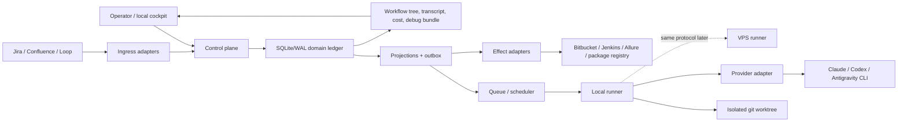
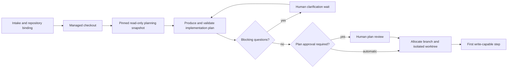
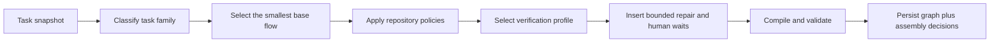
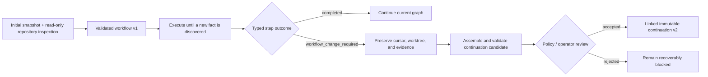

# Tasker: canonical architecture

Status: approved by Planner -> Architect -> Critic consensus, v3  
Date: 2026-08-01  
Audience: owner, reviewer, implementation agents

This document is the canonical product and system architecture for the personal
task-adaptive agent harness. The detailed delivery order lives in
[`implementation-plan.md`](implementation-plan.md); executable acceptance scenarios
live in [`test-spec.md`](test-spec.md).

## 1. Outcome and scope

Tasker accepts a human-selected, frontend-safe work item, assembles an inspectable
workflow for that item, runs it through subscription-backed coding CLIs, and normally
advances it to an open pull request in `waiting_for_review`.

The pilot succeeds when at least 50% of a declared eligible cohort reaches
`waiting_for_review` without mandatory intervention other than:

- optional plan review;
- answers to genuine questions;
- normal pull-request discussion.

This is a personal, single-user, local-first system. Local execution is implemented
first; the runner protocol keeps a later VPS worker possible. Merge, deploy, final
package publish, and production mutation are outside autonomous scope.

The harness may create branches, commits, pull requests, CI runs, review replies,
linked child tasks, and dev publishes only when the active repository policy permits
those effects. Retrospective output never changes the harness automatically.

## 2. Product invariants

1. **No lost work.** A provider error, process kill, Jira error, CI failure, missing
   VPN, quota limit, or human wait must end in a persisted, inspectable state. It must
   not silently terminate the workflow or discard the worktree.
2. **Resume at the smallest safe boundary.** Previously successful nodes are facts.
   A definite push `403` resumes the push node after the environment is repaired; it
   does not redo analysis, implementation, commit, or verification.
3. **Unknown effects are reconciled, never guessed.** A timeout after a remote write
   becomes `unknown_outcome`. Tasker probes the remote system before any retry.
4. **Run history is immutable.** The initial snapshot, graph, prompts, attempts, tool
   events, interventions, and graph revisions are append-only facts.
5. **Human steering is allowed.** Guidance such as "делаешь не то, лучше вот так"
   creates a new attempt in the same run with an immutable intervention overlay. It
   does not rewrite the old prompt or shared harness.
6. **Manual ownership is exclusive.** When the human takes a worktree, automation
   releases its lease and performs no more writes. Returning to automation creates a
   new linked run by default.
7. **Waiting does not consume execution capacity.** Quota, CI, review, translation,
   external artifact, and human-answer waits release the runner slot unless a step
   contract explicitly proves it must retain one.
8. **Dynamic does not mean arbitrary.** An analyzer can propose a graph only from
   registered step types and declared control-flow constructs. A deterministic
   validator rejects unsafe or incomplete graphs before execution.
9. **Planning is universal; human approval is a run policy.** Every task produces and
   validates an implementation plan. A per-run setting decides whether the operator
   must approve that plan; it never skips planning, deterministic validation, or a
   blocking clarification.
10. **Measured and estimated data stay distinct.** Active time, wait time, tokens,
   provider-reported cost, and API-equivalent shadow cost retain source/confidence.
11. **Pilot quality cannot waive correctness.** The `>=50%` KPI is separate from the
    deterministic recovery, replay, idempotency, redaction, and state-machine gates.

## 3. Architecture at a glance



### Canonical truth

SQLite/WAL is the single-instance system of record. JSONL transcripts, OpenTelemetry,
Phoenix/Langfuse, UI state, and reports are projections or artifacts, never competing
histories.

One transaction performs, in fixed order:

1. compare aggregate `expected_version` values;
2. append domain events;
3. update projections;
4. insert outbox commands;
5. acquire, renew, or release the fenced runner lease.

No network or provider side effect occurs inside this transaction.

## 4. Deterministic and agentic boundaries

| Concern | Deterministic code owns | Agent may propose |
|---|---|---|
| Intake | fetch/result classification, eligibility schema, no-partial-run rule | eligibility evidence and task-type hypothesis |
| Workflow | IR parsing, validation, capability/effect checks, loop bounds | template choice, branches, step parameters, expansion proposal |
| Scheduling | ready-set calculation, slots, leases, fencing, wakeups | provider preference within policy |
| Effects | intent, idempotency key, receipt, reconciliation | payload content within step contract |
| Recovery | legal transitions and resume cursor | changed hypothesis or course correction |
| Verification | allowed profiles and required evidence | impact classification and recommended profile |
| Review | thread state machine and idempotent replies | disposition and response text with evidence |
| Retrospective | versioning and approval policy | future-only prompt/workflow/skill diff |

LLM output is always untrusted input at a typed boundary. The engine never executes an
unvalidated graph, effect, predicate, or state transition.

## 5. Core domain model

### 5.1 IntakeRequest

`IntakeRequest` exists before `Task`. This prevents a Jira `400` or an ineligible item
from creating a partially running task.

States:

```text
received -> fetching_context -> ready_for_task_creation
                         \----> waiting_for_intake_repair -> fetching_context
                         \----> not_eligible
                         \----> failed_terminal
```

Rules:

- a definite Jira `400` records the response, classification, and repair action only
  on `IntakeRequest`;
- no `Task`, `Run`, worktree, or provider attempt exists before
  `ready_for_task_creation`;
- `not_eligible` is a normal routing decision with reasons, not an execution failure;
- the operator may correct input/credentials and retry only the intake operation.

### 5.2 Task, Run, Step, Attempt

`Task` is the long-lived work item. `Run` is one immutable execution snapshot.
`Step` is a node instance in a workflow. `Attempt` is one invocation of that node.

Task states:

```text
backlog | queued | running | plan_review | waiting_for_review | revise |
blocked | handed_to_human | cancelled | done
```

Run states:

```text
created | leased | executing | waiting | blocked_recoverable |
completed | handed_off | quarantined | cancelled
```

Step states:

```text
pending | ready | in_progress | waiting | retry_ready |
succeeded | blocked | skipped | cancelled
```

Attempt outcomes:

```text
succeeded | retryable | needs_human | wait_requested |
not_applied | unknown_outcome | fatal
```

`fatal` is reserved for unrecoverable contract/schema/security violations. Ordinary
provider, integration, environment, and CI errors are classified into resumable or
handoff paths and retain their evidence.

### 5.3 Immutable RunSnapshot

The snapshot includes:

- task/context snapshot and base SHA;
- compiled workflow graph and validator report;
- prompt, skill, step-type, policy, and pricing versions/hashes;
- provider capability requirements and routing policy;
- permissions, retry budgets, redaction/retention policy;
- initial artifact manifest.

The snapshot is never edited. A requeue after manual takeover or fundamental replan
creates a new `run_id` linked to its predecessor.

### 5.4 Repository lifecycle around planning

Repository availability and write ownership are separate boundaries:



The managed repository is cloned or refreshed before planning because the planner
needs real code evidence. Planning itself runs against a read-only snapshot pinned to
a base commit. Tasker does not create a task branch or write-capable worktree merely to
ask questions or wait for plan review.

Immediately before the first write, Tasker verifies that the pinned base is still
usable, allocates the task branch and isolated worktree, and persists their locator
and ownership. A recoverable delay keeps the approved plan and planning evidence; it
does not rerun planning unless repository drift invalidates an explicit plan premise.
A cross-repository continuation owns a separate managed checkout, branch, and
worktree, causally linked to the parent run.

## 6. Stable workflow IR and extension contracts

### 6.1 First-wave IR

The initial kernel supports:

```text
sequence | step | branch | bounded_loop | wait | gate | finalize
```

Later milestones add:

```text
parallel | spawn_child_run | join_child_run | declared_expansion
```

The first-wave graph is one immutable compiled artifact per run. Persisted in-run
`GraphRevision` is deliberately deferred until the kernel, intervention, and replay
contracts are proven. Before that milestone, discovery of an unsupported graph shape
opens a gate and produces a replan/new-run proposal without losing the worktree.

Human-authored templates use a typed TypeScript data DSL; the analyzer produces JSON
IR proposals; the deterministic compiler emits the only persisted executable graph.
Agents never generate or import TypeScript code. Zod is the runtime schema source for
all three boundaries. The exact API and library decision are specified in
[`technology-decisions.md`](technology-decisions.md#3-workflow-description).

#### How a task becomes a workflow

`Template -> task graph` is an internal implementation shorthand, not the operator
model. The actual assembly pipeline is:



The family supplies only the stable skeleton: for example a bug adds reproduction,
while every task starts with the same planning boundary. Repository policy supplies
project-specific behavior. A copy change in `twiket/ui-kit` can therefore add
`extract -> translation wait -> pull`, while the same intent in `twiket/avia-web`
stays inside the implementation step because that project stores copy inline or in
locale JSON. An unknown repository receives the conservative simple policy and does
not accidentally inherit external waits or publication effects.

#### Initial assembly is not omniscient

The initial analyzer may read the normalized task, linked context, repository workflow
policy, and repository in a read-only sandbox. It can inspect code and configuration,
but it cannot claim facts that only execution can produce. A reproduction result,
runtime failure, generated diff, or newly discovered dependency is therefore not a
missing input that the initial planner must hallucinate.

Assembly has two horizons:



Every agent/tool step returns a typed outcome. `workflow_change_required` contains a
persisted evidence artifact, the node where the fact appeared, the requested scope
change, and the repositories or external dependencies involved. The executor cannot
edit a graph. It hands the request back to the planner, which produces another
untrusted proposal for the compiler and validator.

The first implementation uses an immutable linked continuation/new run. This keeps
the completed prefix and its hash intact while presenting one causal task history in
the cockpit. Later `GraphRevision` support may append a validated suffix at declared
expansion points, but it cannot rewrite completed nodes. Discovering a shared
component during `bug.reproduce` or `code.implement` is the canonical scenario for
this path.

#### Universal planning boundary

Every accepted root sequence begins with:

```text
task.analyze@1 -> plan.approved@1 gate -> task-specific execution
```

`task.analyze@1` must materialize a typed `ImplementationPlan` artifact. Deterministic
code validates its schema, referenced repositories, permitted effects, verification
requirements, and consistency with the compiled graph. The gate is then resolved in
one of two ways from immutable run settings:

- `planApproval: required` opens `plan_review` and waits for the operator;
- `planApproval: automatic` records an automatic continuation and proceeds.

This setting is selected before the run and cannot be changed after it starts. Plan
feedback creates another planning attempt with immutable guidance; it never edits the
prior plan. A blocking question always opens `human_clarification`, even in automatic
mode. “Do not review my plan” is not permission for the agent to invent a missing
product decision.

The planning strategy is another immutable run setting: `fast`, `ralplan`, or `auto`.
Explicit operator selection wins. `auto` is a deterministic policy decision whose
selected strategy and reason are persisted. Fast planning receives a bounded immutable
repository evidence bundle; ralplan receives the repository through a read-only
consensus-planning boundary. Both must return the same validated decision contract.

Workflow knowledge is resolved from two configuration layers:

```yaml
global:
  repositoryKinds:
    frontend:
      packageRules:
        - id: frontend-ott-package
          pathPrefix: packages/@ott/
          devPublish: pnpm component:publish-dev
          finalPublish: human

projects:
  twiket/avia-web:
    repositoryKind: frontend
    translations: inline_json
    verification:
      rules:
        - when: { changedPaths: [src/locales/**] }
          run: [build]
        - when: { changedPaths: [src/pages/**, src/features/**] }
          run: [a, b, c, build, d]

  twiket/ui-kit:
    repositoryKind: frontend
    translations:
      kind: external
      extract: pnpm translations:extract
      pull: pnpm translations:pull
```

The real files use the typed TypeScript data DSL and Zod boundary; YAML above only
illustrates the ownership. Global policy contains reusable workflow conventions such
as where frontend `@ott` packages live and how they are published. A project profile
contains only workflow-specific facts: translation mode, verification matrix,
commands, repository links, and permitted effects. Code architecture, FSD, reducer
style, and implementation conventions remain agent skills/instructions and are not
duplicated here.

The intended source layout is explicit:

```text
config/workflows/global/frontend.ts
config/workflows/projects/twiket/avia-web.ts
config/workflows/projects/twiket/ui-kit.ts
```

A profile may link a short Markdown note for human context, but prose alone cannot
grant effects or create graph nodes. Only the validated typed fields participate in
deterministic assembly. This keeps the files pleasant to review while preventing an
agent interpretation of documentation from silently changing the workflow.

Resolution precedence is explicit and recorded: hard safety/repository-mandatory
checks cannot be downgraded; a project rule may specialize a matching global default;
the analyzer recommendation fills only fields left open by policy. For example the
shared-component fixture matches the project translation profile and independently
matches the global `frontend-ott-package` publication rule. Both matches appear as
separate assembly decisions.

The compiler persists an ordered `assemblyDecisions` artifact alongside the graph.
Each entry contains structured source provenance, the input fact, selected policy,
and visible graph effect. The
cockpit renders this as **Why this workflow**. The raw base-template diff remains an
expandable diagnostic for harness authors; it is not the primary operator view.

This boundary is deliberately mixed:

- classification and recommended parameters may be agentic later;
- policy lookup, graph construction, loop limits, capability checks, effect safety,
  terminal paths, and persistence are deterministic;
- changing a repository policy affects only future runs because every current run
  keeps its immutable policy snapshot and graph hash.

### 6.2 StepType ABI

Every registered step type declares:

```yaml
id: string
version: semver
input_schema: schema_ref
output_schema: schema_ref
allowed_effects: [effect_kind]
required_capabilities: [capability]
resume_boundary: none | attempt | step
idempotency: none | key | probe
retry_policy: policy_ref
wait_kinds: [wait_kind]
artifact_contracts: [artifact_kind]
redaction_policy: policy_ref
```

The runtime invokes step types through the same `prepare -> execute -> reconcile ->
finalize` protocol. Existing scripts/skills in `/Users/dzhabrail/Projects/work/harness`
are wrapped behind this ABI rather than rewritten.

### 6.3 Predicate ABI

Branch predicates are pure, versioned functions over persisted projection fields and
artifact metadata. Their inputs and result are recorded. They cannot read the network,
current wall clock, or mutable filesystem state directly.

### 6.4 Workflow validation

The validator rejects:

- unknown or incompatible step versions;
- missing terminal paths;
- unbounded cycles;
- predicates with undeclared inputs;
- unmet provider/tool capabilities;
- an effect without idempotency or reconciliation policy;
- wait nodes without a resolution contract;
- a child join without a declared child result;
- an execution path that can strand a worktree without recovery/handoff.

### 6.5 Later graph expansion

After the first-wave kernel is proven, a declared expansion point may produce an
append-only `GraphRevisionProposed`. The validator applies the same rules plus lineage
checks. Accepted revisions retain parent revision/hash and never rewrite earlier
graphs. Until this capability exists, cross-repo discovery becomes a preserved gate
and a new linked run rather than an unsafe graph mutation.

Workflow-change approval is a rollout policy, not a permanent operator obligation.
Every continuation is always compiled and deterministically validated. The intended
run policies are:

```text
review_all -> auto_safe -> auto_all_valid
```

The pilot starts with `review_all` so rejected and surprising candidates are visible.
After retrospective evidence establishes stable capability/effect classes,
`auto_safe` may accept validated, non-escalating changes and pause only for new
repositories, new effect classes, missing policy, or a blocking question. The target
mode is `auto_all_valid`: any candidate satisfying the deterministic contract is
appended automatically. No mode can bypass the validator or rewrite the completed
prefix.

## 7. Durable Wait, human steering, and manual takeover

### 7.1 Wait ABI

`Wait` is only a resumable condition while the harness retains ownership.

Kinds:

```text
quota_reset | human_clarification | ci_build | review_event |
translation_ready | external_artifact | retry_backoff | provider_resume_ready
```

Fields:

```text
wait_id, scope, kind, resume_cursor, resolution_schema,
slot_policy, opened_by_event_id, status, deadline_at?, resolved_by_event_id?
```

A normalized `Signal` resolves a wait only when it matches the wait's correlation key
and resolution schema. Duplicate signals are audited no-ops.

`human_clarification` is mandatory whenever the planner or executor identifies a
missing decision that can materially change scope, behavior, repository ownership, or
an external effect. It is independent from optional plan review. The question,
available evidence, answer schema, operator answer, and resumed attempt are persisted;
the runner slot is released while waiting.

### 7.2 InterventionEvent

When a run asks for help or the operator sees a wrong direction, the operator submits
run-specific guidance through the cockpit. Tasker appends:

```text
InterventionEvent {
  run_id, step_id, prior_attempt_id,
  kind, guidance_artifact_id, author, created_at
}
```

The next attempt input is materialized as:

```text
immutable snapshot baseline
+ durable artifacts from succeeded steps
+ resolved gate answers
+ approved intervention events since the prior attempt
```

The prior prompt/hash/transcript remains unchanged. A later correction to the shared
harness is a separate versioned change and affects only future runs.

### 7.3 ManualTakeover

Manual takeover is not a wait. It transfers write authority.

Protocol:

1. persist takeover request and current cursor;
2. stop dispatch and reconcile any in-flight effect;
3. checkpoint artifacts/transcript/worktree state;
4. release the fenced runner lease;
5. mark automation ownership closed;
6. create a handoff packet with cwd, branch, base/head SHA, diff, last safe step,
   pending effects, open waits, test evidence, and recommended next action;
7. grant the human exclusive worktree ownership.

The default return path is a new linked run after Tasker reconciles the human-edited
worktree and remote state. Same-run re-entry is allowed only when Tasker proves that no
material human write occurred.

## 8. Recovery and external effects

Every outward effect follows:

```text
intent persisted -> dispatch -> receipt/probe -> classification -> state transition
```

Classifications:

- `applied`: desired remote state is proven;
- `not_applied`: remote system proves it did not happen; safe step-local retry;
- `unknown_outcome`: the system cannot prove either result; retry is blocked pending
  reconciliation.

### Concrete `403 / VPN` contract

A definite Bitbucket push `403` before application is `not_applied`. The local commit,
diff, verification evidence, and worktree remain. Tasker opens a recoverable
infrastructure wait/gate at the push step. After the operator enables VPN and the
preflight probe succeeds, Tasker creates a new push attempt only.

A connection loss after sending the push is `unknown_outcome`. Tasker compares remote
refs and commit SHA before deciding whether to finalize as `applied` or retry as
`not_applied`.

The same rules cover PR creation/update, comments, builds, Jira writes, provider
start/resume/cancel, dev publish, and final artifact detection.

Expected domain rejection and operational failure are typed values rather than thrown
control flow. Adapters normalize third-party exceptions at their boundary; a pure,
exhaustive policy maps the result to `retry | wait | reconcile | gate | fail |
quarantine`. Mutating adapters return only `applied`, `not_applied`, or
`unknown_outcome` variants whose required receipt/probe fields make invalid
combinations unrepresentable. The full taxonomy is in
[`technology-decisions.md`](technology-decisions.md#4-domain-error-and-recovery-model).

## 9. Provider and runner contracts

Provider choice is not hardcoded. A local compatibility spike evaluates installed
Claude Code, Codex, and Antigravity versions for:

- non-interactive subprocess behavior;
- structured event completeness;
- resume after kill;
- permission/approval behavior;
- quota error classification;
- token/cost fields;
- installed-version stability.

The first adapter is selected from that report. The common adapter supports
`probe/start/resume/cancel/reconcile` and exposes a capability map. Provider session
resume is an optimization; if unavailable, a new attempt consumes persisted artifacts
without restarting the entire workflow.

The runner protocol contains only task/run identifiers, snapshot hash, worktree
locator, fence token, commands, heartbeats, events, and artifact references. Local and
future VPS runners implement the same protocol. No HA or multi-user scheduler is built
for v1.

## 10. Required dynamic workflow families

### 10.1 CI and review run concurrently

After a shareable PR exists, CI watching and human discussion may proceed in parallel.
Readiness is a deterministic policy over independent projections:

```text
PR exists
AND no accepted/actionable review work is pending
AND CI has no agent-actionable failure
AND no unresolved unsafe external effect exists
```

CI classification:

- `ours`: bounded analyze/fix/verify/push loop;
- `flaky`: bounded rerun with evidence and retry budget;
- `external`: wait/escalate without invalidating completed work;
- `infrastructure`: recoverable wait/gate;
- `green`: satisfy CI readiness.

### 10.2 PR is the canonical code-review conversation channel

The cockpit mirrors thread state, but review-specific questions and replies are written
to the Bitbucket PR. PR is not the universal channel for plan, translation, intake, or
infrastructure decisions.

Every review thread has a disposition:

```text
unclassified -> accepted | question | disagree_with_evidence |
                already_addressed | blocked | resolved
```

Only `accepted` creates code-revision work automatically. Other dispositions post an
idempotent PR reply and may open a clarification gate. Tasker does not resolve a human
thread unless repository policy explicitly permits it.

### 10.3 Project-specific translation policy

Project workflow policy is an operational contract for the harness, not a substitute
for repository architecture documentation. It records workflow-only facts such as
translation handling, verification obligations, required human gates, and external
signals that can pause/resume a run.

Translation orchestration is conditional on both task intent and repository policy.
For an external-translation project, the workflow changes source text, runs
extraction/upload, opens a slot-free `translation_ready` wait, consumes a correlated
Loop/manual/external signal, runs the pull/sync command, and resumes at the following
node. A process restart during the wait changes nothing.

For a project whose copy is maintained inline or in locale JSON, those nodes do not
exist. The code-change step edits the project-owned source and verification continues
normally. This is absence by policy, not a skipped translation wait.

### 10.4 Cross-repository shared component

The eventual composition contract is:

1. parent produces a typed `ChildRunRequest` with repository, requested outcome,
   policy, and result schema;
2. a separate child task/run/worktree is created and causally linked;
3. child performs the component change and automated dev publish;
4. child emits a versioned `DevArtifactPublished` result;
5. parent join/wait consumes that version and runs integration verification;
6. final publish is a human gate;
7. an exact released version or registry probe resolves the gate and resumes parent.

Parent and child ledgers remain separately replayable. If automatic child composition
is not yet implemented, the same contract can be satisfied by a manually created child
and operator-supplied typed result without losing parent work.

### 10.5 Change-aware verification

The analyzer emits a `VerificationPlan` artifact with rationale. Allowed profiles:

```text
build_only | targeted_tests | full_suite | visual_compare |
snapshot_update | composed
```

Inputs include changed paths, dependency impact, shared-package use, rendered UI
impact, task acceptance criteria, repository rules, and prior failures. The compiler
materializes the selected verification subgraph; policy may upgrade but never silently
downgrade repository-mandated checks.

## 11. Observability and debugging

The cockpit must expose:

- intake, task, run, step, attempt, wait, review, and child-run state;
- the exact graph and active cursor;
- prompt/input pack and run-specific intervention diff;
- typed event transcript and effect receipts;
- active time, wall time, wait time, tokens, and shadow cost per attempt/step/run;
- worktree diff and artifact lineage;
- why a branch, verification profile, provider, retry, wait, or escalation was chosen.

Each paused, blocked, handed-off, or terminal run can produce a `DebugBundle`:

```text
snapshot + graph + validator report + ordered events + projection checksum +
step/attempt lineage + wait/signal history + effect intents/receipts/probes +
provider/version metadata + redacted transcript + artifact manifest + worktree status
```

Replay reconstructs projections only; it never reissues effects.

## 12. Security, retention, and redaction

Secrets are removed before durable persistence. Every event/artifact records
`clean | redacted | blocked`. Raw blocked material is not made readable through lineage
metadata. Provider/integration credentials remain in local or runner-specific secret
stores, never in snapshots.

Unsupported event, snapshot, step ABI, or graph schema versions quarantine the run and
make no new commands visible. Upcasters are explicit and tested.

## 13. Retrospective loop

For completed, blocked, cancelled, or handed-off runs, retrospective output records:

- planned versus actual path;
- failure/retry/wait/intervention causes;
- cost and time hotspots;
- avoidable human interventions;
- workflow/step/prompt improvement proposals;
- hypothesis, expected metric, rollback rule, and affected future versions.

Proposal states are `draft -> approved/rejected -> applied_to_future_version`.

## 14. Recommended implementation stack

- Node.js 24 LTS, ESM, pnpm, and strict TypeScript;
- Zod as the only runtime schema system and JSON-Schema projection source;
- `better-sqlite3` in WAL mode with explicit SQL migrations and transaction
  boundaries; no ORM/query builder in the first wave;
- Fastify local API plus a native server-sent event stream for the cockpit;
- React + Vite and a semantic workflow tree; React Flow is deferred until graph
  complexity proves it necessary;
- Execa behind a Tasker-owned subprocess port around provider CLIs and existing
  harness skills/scripts;
- Pino for redacted operational diagnostics, separate from the canonical ledger;
- Vitest + fast-check for reducers/contracts/recovery and Playwright for cockpit/E2E;
- no third-party workflow, state-machine, error-runtime, Result-monad, or pattern-
  matching library in the domain/control-flow layer;
- optional OpenTelemetry export only after ledger/replay readiness is green.

The dependency timing, rejected alternatives, test fixture architecture, and upgrade
rules are canonical in [`technology-decisions.md`](technology-decisions.md).

The implementation should remain a modular monolith:

```text
src/
  domain/        # aggregates, commands, events, reducers, policies
  ledger/        # sqlite, migrations, projections, outbox, snapshots
  workflow/      # IR, step registry, compiler, validator, predicates
  queue/         # ready set, slots, leases, waits, wakeups
  runner/        # protocol, local runner, worktree ownership
  providers/     # probes and CLI adapters
  integrations/  # thin wrappers around Jira/Bitbucket/Jenkins/Allure/Loop/Git
  review/        # review cycles and thread dispositions
  observability/ # cockpit projections, cost, debug bundles, optional exports
  retrospective/
  app/           # CLI, local API, React cockpit
```

## 15. Architecture decision record

### Decision

Build a custom ledger-first modular monolith on TypeScript/Node.js and SQLite/WAL.
Use a stable workflow IR, typed resumable waits, separate manual ownership transfer,
immutable intervention events, explicit external-effect reconciliation, and later
child-run/declared-expansion composition.

### Drivers

1. Work and external effects must survive real interruptions without restarting the
   task or duplicating mutations.
2. Dynamic workflows need inspectable, validated contracts rather than arbitrary
   agent-generated scripts.
3. The system is personal/local-first and must show value before adding platform ops.

### Alternatives considered

- Temporal/Hatchet as the primary runtime: strong waits, but still requires the same
  custom domain ledger and adds a second history/ops surface too early.
- LangGraph/checkpointer: duplicates graph/cursor/replay ownership and remains a poor
  fit for worktree ownership, review lifecycle, and effect reconciliation, including
  when nested inside agent steps.
- JSONL-only journal: simple, but insufficient for atomic projections/outbox/leases
  and safe concurrent recovery.

### Consequences

- More custom kernel code and a higher correctness burden.
- Very early demos must remain small to avoid building a platform before proving use.
- Rich graph revisions, child orchestration, provider trio, VPS, and external tracing
  are staged behind kernel readiness rather than built together.

### Follow-ups

- implement and verify the milestone ladder in `implementation-plan.md`;
- select the first provider only after the compatibility spike;
- reassess an external durable scheduler if multiple hosts must compete for work or
  custom wakeup/lease defects cause repeated duplicate-effect incidents.
