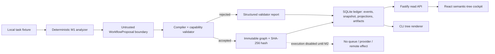
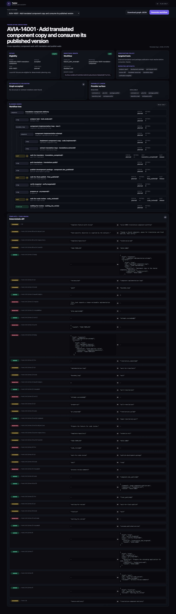

# M1 implementation — visible task-to-workflow slice

Status: **implemented and verified**, 2026-08-01.

M1 is the first operator-visible vertical slice. A local fixture task is converted to
an untrusted `WorkflowProposal`, validated against versioned registries, compiled to an
immutable graph, persisted in SQLite, and rendered through both a browser cockpit and
a CLI. No workflow node is executed in this milestone.



## What is implemented

- three accepted fixture families:
  - short bugfix with reproduction and bounded repair;
  - feature with an optional plan-review gate and visual/full verification;
  - translation plus shared-component workflow with translator and final-publish
    waits;
- five rejected fixtures: unknown step, missing terminal path, malformed unbounded
  loop, unmet capability, and unsafe effect metadata;
- versioned step, predicate, and wait registries;
- deterministic template selection and task-specific materialization;
- strict Zod parsing at fixture, proposal, projection, HTTP, and browser boundaries;
- graph SHA-256, template-to-task diff, retry budgets, waits, expected artifacts,
  capability inventory, and verification rationale;
- atomic ledger commit of intake/task/workflow events, snapshot, projections, and
  linked proposal/validator/diff/graph artifacts;
- persisted accepted and rejected outcomes with no outbox command;
- Fastify endpoints for fixtures, intake/task/run/graph projections, workflow
  generation/readback, and graph download;
- read-only React/Vite cockpit and a dependency-free CLI semantic tree;
- real file-backed restart, API-contract, and Playwright browser tests.

## Operator demo

Use the pinned runtime:

```bash
fnm exec --using=24.16.0 /usr/local/bin/pnpm install
fnm exec --using=24.16.0 /usr/local/bin/pnpm verify
fnm exec --using=24.16.0 /usr/local/bin/pnpm test:e2e
fnm exec --using=24.16.0 /usr/local/bin/pnpm demo:m1
```

Open `http://127.0.0.1:4311`, choose a fixture, and click **Generate workflow**. The
cockpit shows intake eligibility, graph status/hash, verification policy, capabilities,
semantic tree, waits and slot policy, retry bounds, template diff, validation errors,
and a graph JSON download. Select `invalid-unknown-step` to see a rejected proposal
that never becomes executable.



The production demo uses `.tasker/m1.sqlite`. To isolate a run:

```bash
TASKER_DB_PATH=/tmp/tasker-m1-demo.sqlite \
  fnm exec --using=24.16.0 /usr/local/bin/pnpm demo:m1
```

CLI fallback:

```bash
fnm exec --using=24.16.0 /usr/local/bin/pnpm m1 generate avia-13236-short-bug \
  --db /tmp/tasker-m1-cli.sqlite
fnm exec --using=24.16.0 /usr/local/bin/pnpm m1 show avia-13236-short-bug \
  --db /tmp/tasker-m1-cli.sqlite
```

## Durable behavior proven in M1

- identical fixture and policy input produces the same compiled graph hash;
- all three accepted families produce distinct graphs;
- closing and reopening the SQLite ledger restores the same graph hash and diff;
- repeated generation returns the persisted result instead of creating duplicate
  work;
- rejected proposals persist their exact report but have no graph artifact or outbox
  command;
- LLM/provider output is never executed; `workflow.executable` is always `false`.

## Exact boundary before M2

M1 does not calculate a ready set, traverse nodes, acquire leases, dispatch an outbox,
run a provider, execute shell/git commands, resolve waits, or accept operator
interventions. M2 will add durable traversal with deterministic stub executors while
preserving the M1 graph and projection contracts.
