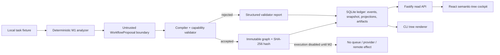
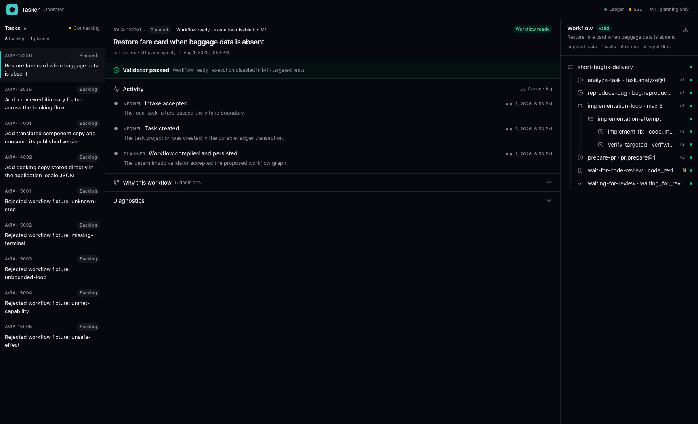

# M1 implementation — visible task-to-workflow slice

Status: **implemented and verified**, 2026-08-01.

M1 is the first operator-visible vertical slice. A local fixture task is converted to
an untrusted `WorkflowProposal`, validated against versioned registries, compiled to an
immutable graph, persisted in SQLite, and rendered through both a browser cockpit and
a CLI. No workflow node is executed in this milestone.



## What is implemented

- four accepted fixtures across three workflow families:
  - short bugfix with reproduction and bounded repair;
  - feature with an optional plan-review gate and visual/full verification;
  - application-owned copy stored inline/JSON, with no translation commands or wait;
  - shared-component workflow whose project policy independently adds translator and
    final-publish waits;
- five rejected fixtures: unknown step, missing terminal path, malformed unbounded
  loop, unmet capability, and unsafe effect metadata;
- versioned step, predicate, and wait registries;
- deterministic template selection and task-specific materialization;
- explicit repository workflow policies and persisted **Why this workflow** assembly
  decisions;
- project workflow policy is treated as harness configuration rather than app
  architecture documentation: M1 resolves translation handling from it; the typed
  verification matrix and additional manual-gate facts are the next profile extension
  described in the canonical architecture;
- a separate global frontend package rule: component paths under `packages/@ott/`
  receive the reusable dev-publish plus human-final-publish flow;
- strict Zod parsing at fixture, proposal, projection, HTTP, and browser boundaries;
- graph SHA-256, template-to-task diff, retry budgets, waits, expected artifacts,
  capability inventory, and verification rationale;
- compiler rejection of wait cursors that reference a node absent from the graph;
- an explicit `consume-published-version` step after the human final-publish wait in
  the cross-repository flow;
- atomic ledger commit of intake/task/workflow events, snapshot, projections, and
  linked proposal/validator/diff/graph artifacts;
- persisted accepted and rejected outcomes with no outbox command;
- Fastify endpoints for fixtures, the operator task queue, persisted activity,
  intake/task/run/graph projections, workflow generation/readback, and graph download;
- native server-sent events that replay new ledger activity and refresh the selected
  task without inventing an agent transcript;
- read-only three-pane React/Vite operator console and a dependency-free CLI semantic
  tree;
- real file-backed restart, API-contract, and Playwright browser tests.

## Operator demo

Use the pinned runtime:

```bash
fnm exec --using=24.16.0 /usr/local/bin/pnpm install
fnm exec --using=24.16.0 /usr/local/bin/pnpm verify
fnm exec --using=24.16.0 /usr/local/bin/pnpm test:e2e
fnm exec --using=24.16.0 /usr/local/bin/pnpm demo:m1
```

Open `http://127.0.0.1:4311`, choose a fixture, and click **Generate workflow**. The
left pane is the task queue, the center is the selected task's persisted activity,
validation surface and **Why this workflow**, and the sticky right pane is the current
workflow tree. It also shows graph status/hash, verification policy, capabilities,
waits and slot policy, retry bounds, validation errors, and a graph JSON download. The
raw template diff is collapsed under diagnostics. Select `invalid-unknown-step` to see
a rejected proposal that never becomes executable.



The production demo uses `.tasker/m1-operator.sqlite`. To isolate a run:

```bash
TASKER_DB_PATH=/tmp/tasker-m1-demo.sqlite \
  fnm exec --using=24.16.0 /usr/local/bin/pnpm demo:m1
```

CLI fallback:

```bash
fnm exec --using=24.16.0 /usr/local/bin/pnpm m1 generate avia-13236-short-bug \
  --db /tmp/tasker-m1-cli.sqlite
fnm exec --using=24.16.0 /usr/local/bin/pnpm m1 show avia-13236-short-bug \
  --db /tmp/tasker-m1-cli.sqlite
```

## Durable behavior proven in M1

- identical fixture and policy input produces the same compiled graph hash;
- all four accepted task/policy combinations produce distinct graphs;
- external translation is added only for the configured component repository; an
  inline/JSON copy task contains no translation command or wait;
- the `@ott` component path independently matches a reusable global frontend package
  publication rule;
- closing and reopening the SQLite ledger restores the same graph hash and diff;
- repeated generation returns the persisted result instead of creating duplicate
  work;
- rejected proposals persist their exact report but have no graph artifact or outbox
  command;
- LLM/provider output is never executed; `workflow.executable` is always `false`.

## Exact boundary before M2

M1 does not calculate a ready set, traverse nodes, acquire leases, dispatch an outbox,
run a provider, execute shell/git commands, resolve waits, or accept operator
interventions. M2 will add durable traversal with deterministic stub executors while
preserving the M1 graph and projection contracts.

The real provider replacement for the deterministic analyzer is documented in
[`m1.5-implementation.md`](m1.5-implementation.md).
