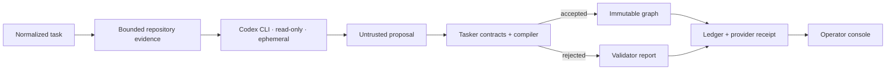

# M1.5 implementation — real read-only workflow assembly

> **Historical pre-Temporal record.** Provider/analyzer behavior remains relevant;
> execution-runtime conclusions are superseded by
> [`architecture.md`](architecture.md).

Status: **implemented and verified**, 2026-08-01.

M1.5 replaces the fixture-only analyzer at the operator boundary with a real Codex CLI
session authenticated by the user's ChatGPT subscription. The provider remains an
untrusted planner: Tasker collects bounded read-only evidence, validates the structured
proposal, derives capabilities and artifacts itself, compiles the graph, and persists the
accepted or rejected result atomically.



## Operator path

Start the console against the repository whose workflow policy and manifest should be
used during assembly:

```bash
TASKER_REPOSITORY_PATH=/absolute/path/to/repository \
  pnpm demo:m1
```

Open `http://127.0.0.1:4311` and click **Generate workflow** on a backlog task. The
server single-flights concurrent requests, invokes the subscription CLI, and persists the
provider session, model, service tier, duration, measured token usage, prompt hash,
proposal, validator report, and graph. A repeated request returns the persisted
workflow without another provider call.

The same boundary is available without the browser:

```bash
pnpm analyze:codex avia-13236-short-bug \
  --repo /absolute/path/to/repository \
  --db /tmp/tasker-analyzer.sqlite
```

Use `TASKER_WORKFLOW_PROVIDER=deterministic` only for deterministic contract/browser
tests. It is not the default server behavior.

## Provider isolation and safety

- `codex exec --sandbox read-only --ephemeral --output-schema ... --json`;
- explicit `gpt-5.4`, low reasoning, and fast subscription tier, independent of the
  desktop app's changing model setting;
- temporary `CODEX_HOME` containing only a mode-0600 copy of subscription auth;
- temporary empty CLI workspace, so the agent receives only Tasker's bounded evidence
  bundle and cannot turn initial planning into an unbounded repository investigation;
- optional recursive DSL fields are carried in `sourceJson` because provider strict JSON
  schemas require every object property; Tasker then parses that string with the
  authoritative recursive workflow schema;
- no proposal is executable in M1.5, and no outbox command is created.

The first unconstrained smoke run used 434,824 measured tokens and 100.8 seconds. After
separating deterministic evidence collection from LLM synthesis, the same accepted
bugfix workflow used 37,835 measured tokens and 42.1 seconds. This is an 11.5x token
reduction and is persisted as observability evidence, not hidden as provider overhead.
The hypothetical API dollar value remains `null` until a versioned model rate card is
configured; Tasker does not invent a price for subscription traffic.

## Runtime discovery boundary

Initial assembly is intentionally not omniscient. Reproduction or implementation may
later discover a shared component, external process, changed task scope, or broader
verification requirement. Step contracts can return typed
`workflow_change_required` with evidence. The current immutable graph and worktree stay
intact; M2 will pause the run and compile a linked continuation. The executor never edits
the active graph in place.
