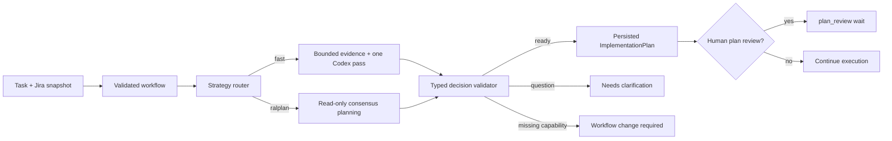

# M2.1: real typed implementation planning

Status: **implemented and verified**, 2026-08-02

This slice replaces the `task.analyze@1` planning stub with a real, persisted
`ImplementationPlan` boundary. Planning happens after workflow compilation and before
the run is admitted to execution. It can inspect the task, immutable workflow, and a
read-only repository snapshot, but it cannot create a branch, worktree, diff, commit,
or remote effect.



## Operator path

After generating a workflow, the task header exposes two immutable run settings:

- **Planning strategy**: `Auto plan`, `Fast plan`, or `Ralplan`;
- **Review plan**: whether the ready plan must stop for human approval.

Pressing **Test workflow** first runs implementation planning. The center pane then
shows the persisted plan title, summary, numbered steps, file/search targets,
verification per step, selected strategy and reason, attempt number, provider,
duration, and measured token usage. The run either enters `plan_review` or continues
through the same deterministic approval boundary automatically.

At plan review, **Request changes** persists the operator's exact guidance and creates
attempt `N + 1`. The old plan and provider receipt remain immutable. Only the planning
node is repeated; the task and compiled workflow are not regenerated.

The HTTP contract is:

```json
{
  "settings": {
    "planApproval": "required",
    "planningStrategy": "auto"
  }
}
```

`GET /api/workflows/:taskReference/implementation-plan` returns the current persisted
planning record. Repeating Start with different settings after run creation returns a
conflict instead of silently changing policy.

## Strategy routing

The router is deterministic and its reason is persisted:

- an explicit `fast` or `ralplan` operator selection always wins;
- `auto` currently selects `ralplan` for a `shared_component` task because it crosses
  repository/publication boundaries;
- other admitted task families use `fast` and record the bounded graph size used in
  that choice.

`fast` receives an immutable evidence bundle assembled by Tasker: a bounded repository
file manifest, exact source-path hints from the task, relevant workflow/project policy
documents, and lexically related text files. It runs in an empty read-only workspace
and cannot expand its own search. `ralplan` gets the repository read-only and uses the
installed Planner -> Architect -> Critic consensus surface. Both return the same Zod-
validated decision contract.

The first unconstrained fast smoke used 405,255 input tokens (351,104 cached) and 85.8
seconds. Moving repository traversal out of the agent reduced the next real Codex CLI
smoke to 59,500 input tokens and 40.1 seconds while retaining concrete file targets.
The final evidence cap is smaller again (600 paths and 48 KiB of relevant contents).
This final cap is covered structurally and by unit tests; its exact live token count
will vary with the repository and subscription CLI context.

## Persistence and recovery

Planning state is stored separately from the immutable graph under
`implementation-plan:<taskReference>`. Each attempt persists:

- requested/selected strategy and selection reason;
- operator guidance, start/completion time, and attempt number;
- typed plan, blocking questions, workflow-change request, or normalized failure;
- provider/CLI/model/session/prompt hash, duration, and measured token usage;
- an artifact link attached to the durable run before `task.analyze@1` completes.

A provider timeout, malformed output, missing CLI, or provider failure leaves a
recoverable `failed` record. Retrying planning does not recreate the Jira snapshot,
workflow, or completed run prefix. Concurrent Start calls are single-flighted per task.

## Verified evidence

- real `codex-cli 0.120.0`, subscription-authenticated, read-only fast planning smoke;
- provider contract tests for fast, ralplan routing, structured output, and invalid
  output rejection;
- HTTP contract tests for plan persistence, immutable run link, plan revision, and
  automatic shared-component -> ralplan selection;
- browser tests for strategy selection, visible attempt 1, operator feedback, and
  visible attempt 2;
- complete formatting, strict server/cockpit typecheck, lint, Vitest, build, and
  Playwright verification.

## Still intentionally pending

- answer UI and durable resume for `needs_clarification`;
- compiling `workflow_change_required` into a validated linked continuation;
- versioned model rate cards for hypothetical API-dollar estimates;
- real implementation/write nodes, branch/worktree creation, Bitbucket PR, and CI;
- generic mid-execution operator guidance outside plan review.

