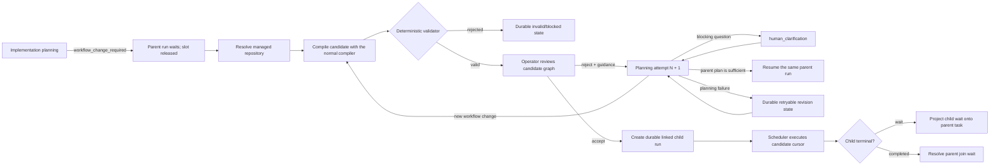

# M2.2: immutable workflow continuation and linked execution

Status: delivered 2026-08-03 for planning-originated workflow changes, operator-guided
revision, and linked child-run execution.

This slice turns a planner result of `workflow_change_required` into a real,
persisted workflow candidate. It does not edit the accepted parent graph and it does
not restart the task.

## Operator path

The cockpit continues to show the original task and one causal activity history in the center. During
review, the right pane switches to the candidate graph rather than pretending the
parent graph changed. After acceptance, that same graph displays the linked child's
runtime states while the task list derives its status from the child. The compact continuation surface shows the reason, target
repository, required capabilities, attempt, validation problems, and accept/reject
controls. Candidate analyzer provenance, wall time, measured tokens, and hypothetical
API-cost availability are loaded from the candidate's persisted provider receipt.

Pilot policy is `review_all`. This is rollout policy, not a validator substitute. A
future `auto_safe` or `auto_all_valid` policy can remove the operator gate only after
retrospective evidence supports it.

## Persistence and immutability

The parent and candidate have different task references, workflow IDs, and graph
hashes. Candidate compilation uses the same task analyzer boundary, compiler, and
validator as initial workflow generation. Saving a candidate deliberately skips the
normal `m1_task` projection, so the synthetic candidate cannot replace the operator's
parent task.

Continuation state is stored under:

- aggregate: `workflow-continuation:<parent-task-reference>`;
- projection: `workflow_continuation_by_parent`;
- immutable artifact per aggregate version:
  `continuation-link:<continuation-id>:version-N`;
- candidate workflow: normal workflow projections and artifacts under its own task
  reference.
- child run: normal `m2_run_by_task`/`m1_run` projections with a discriminated
  `workflow_continuation` lineage containing the parent task, parent run, and
  continuation IDs.

The continuation record carries the parent run/workflow/hash, source planning
artifact and request, review policy, attempt, candidate identity, and terminal or
recoverable issues. Once linked, it also carries the child task/run identity. Restart
recovery reads these projections; it does not call the planner or rebuild the candidate.

The parent stays at `linked_continuation_running`, a durable slot-releasing join wait.
It never copies the candidate graph or rewrites completed node states. When the child
completes, reconciliation resolves that join, marks the parent continuation boundary
succeeded, and skips only the unreachable remainder of the old suffix.

## Validation

The candidate must first pass normal deterministic workflow validation. Continuation
lineage then adds these checks:

- its graph hash must differ from the parent hash;
- the requested repository must be represented in the candidate graph;
- every capability requested by planning must be present in the candidate's required
  capability set;
- the first wave accepts at most one newly discovered repository.

An invalid candidate stays visible but cannot be accepted. The current parent graph,
cursor, effects, and evidence remain intact.

## Recoverable infrastructure failure

Repository resolution or provisioning can return a retryable problem such as a
Bitbucket `403` while VPN is disconnected. Tasker records `blocked` with the exact
problem and keeps the parent at the slot-releasing
`workflow_continuation_review` wait. **Retry** creates continuation attempt `N + 1`
against the same parent run. It does not recreate the task or repeat prior work.

Non-retryable failures such as an ambiguous repository or unmet capability remain
operator-attention states.

## HTTP surface

- `GET /api/workflows/:taskReference/continuation`
- `POST /api/workflows/:taskReference/continuation/review`
  - `{ "decision": "accept", "continuationId": "..." }`
  - `{ "decision": "reject", "continuationId": "...", "guidance": "..." }`
- `POST /api/workflows/:taskReference/continuation/retry`
- `GET /api/workflows/:candidateTaskReference` for the candidate graph

Accept is idempotent. It first records approval, then creates or reuses the candidate's
child run, changes the parent wait to `linked_continuation_running`, persists the child
link, and lets the configured scheduler claim it. Retrying the same HTTP command after
a process failure resumes those steps instead of creating another child. Reject is
idempotent for the same guidance, preserves
both graphs, and immediately creates implementation-planning attempt `N + 1`.
That attempt can compile a new continuation candidate, open a blocking clarification,
or supersede the rejected candidate with a normal parent implementation plan. A
failed revision attempt remains visible and the same reject command retries it;
transport retry never recreates the task.

## Verified behavior

- HTTP contracts for valid proposal, accept, reject-to-new-candidate,
  reject-to-parent-plan, reject-to-clarification, invalid capability, and transient
  `403` retry;
- restart recovery of the parent wait, parent hash, revised continuation projection,
  both immutable candidate graphs, and the linked child cursor/lineage;
- direct and capacity-bounded scheduler execution to the child's code-review wait;
- parent task/status/activity projection from child events without exposing the
  synthetic child as another task;
- child completion resolving the parent join and producing one completed task;
- browser flow from task start through rejection guidance, candidate attempt `N + 1`,
  and accept;
- browser assertion that the parent hash is unchanged before and after acceptance;
- full formatting, strict typecheck, lint, Vitest, production build, and Playwright
  verification.

## Exact next boundary

The linked child currently executes deterministic stub nodes. It does not allocate a
branch/worktree or perform repository writes, and the workflow-change request still
originates from implementation planning rather than a real executor result.

The next implementation slice is write preparation: pin the approved repository base,
allocate a task branch and isolated worktree immediately before the first write-capable
node, persist ownership, and recover repository/VPN failures without rerunning planning.
After real reproduction/implementation nodes exist, their typed
`workflow_change_required` outcomes reuse this same continuation contract.
