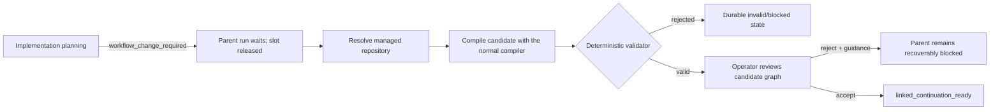

# M2.2: immutable workflow continuation review

Status: delivered 2026-08-02 for planning-originated workflow changes.

This slice turns a planner result of `workflow_change_required` into a real,
persisted workflow candidate. It does not edit the accepted parent graph and it does
not restart the task.

## Operator path

The cockpit continues to show the original task and activity in the center. During
review, the right pane switches to the candidate graph rather than pretending the
parent graph changed. The compact continuation surface shows the reason, target
repository, required capabilities, attempt, validation problems, and accept/reject
controls. Candidate analyzer provenance, wall time, measured tokens, and hypothetical
API-cost availability are loaded from the candidate's persisted provider receipt.

Pilot policy is `review_all`. This is rollout policy, not a validator substitute. A
future `auto_safe` or `auto_all_valid` policy can remove the operator gate only after
retrospective evidence supports it.

## Persistence and immutability

The parent and candidate have different task references, workflow IDs, and graph
hashes. Candidate compilation uses the same task analyzer boundary, compiler, and
validator as initial workflow generation. Saving a candidate deliberately skips the
normal `m1_task` projection, so the synthetic candidate cannot replace the operator's
parent task.

Continuation state is stored under:

- aggregate: `workflow-continuation:<parent-task-reference>`;
- projection: `workflow_continuation_by_parent`;
- immutable artifact per aggregate version:
  `continuation-link:<continuation-id>:version-N`;
- candidate workflow: normal workflow projections and artifacts under its own task
  reference.

The continuation record carries the parent run/workflow/hash, source planning
artifact and request, review policy, attempt, candidate identity, and terminal or
recoverable issues. Restart recovery reads these projections; it does not call the
planner or rebuild the candidate.

## Validation

The candidate must first pass normal deterministic workflow validation. Continuation
lineage then adds these checks:

- its graph hash must differ from the parent hash;
- the requested repository must be represented in the candidate graph;
- every capability requested by planning must be present in the candidate's required
  capability set;
- the first wave accepts at most one newly discovered repository.

An invalid candidate stays visible but cannot be accepted. The current parent graph,
cursor, effects, and evidence remain intact.

## Recoverable infrastructure failure

Repository resolution or provisioning can return a retryable problem such as a
Bitbucket `403` while VPN is disconnected. Tasker records `blocked` with the exact
problem and keeps the parent at the slot-releasing
`workflow_continuation_review` wait. **Retry** creates continuation attempt `N + 1`
against the same parent run. It does not recreate the task or repeat prior work.

Non-retryable failures such as an ambiguous repository or unmet capability remain
operator-attention states.

## HTTP surface

- `GET /api/workflows/:taskReference/continuation`
- `POST /api/workflows/:taskReference/continuation/review`
  - `{ "decision": "accept" }`
  - `{ "decision": "reject", "guidance": "..." }`
- `POST /api/workflows/:taskReference/continuation/retry`
- `GET /api/workflows/:candidateTaskReference` for the candidate graph

Accept is idempotent and changes only the parent run wait to
`linked_continuation_ready`. Reject is idempotent for the same guidance and preserves
both graphs.

## Verified behavior

- HTTP contracts for valid proposal, accept, reject, invalid capability, and transient
  `403` retry;
- restart recovery of parent wait, parent hash, continuation projection, and candidate
  graph;
- browser flow from task start through candidate review and accept;
- browser assertion that the parent hash is unchanged before and after acceptance;
- full formatting, strict typecheck, lint, Vitest, production build, and Playwright
  verification.

## Exact next boundary

This slice intentionally stops accepted work at `linked_continuation_ready`; it has
not yet created or executed a linked child run. Operator rejection stores guidance
and remains recoverably blocked, but a new planning/candidate attempt from that
guidance is not wired yet. Runtime-originated `workflow_change_required` from
reproduction or implementation must reuse this same contract after real node
execution exists.

The next implementation slice is linked child-run execution: create a child run with
explicit parent/continuation lineage, preserve the completed parent prefix, execute
the candidate through the existing scheduler, and project both as one causal task
history.
