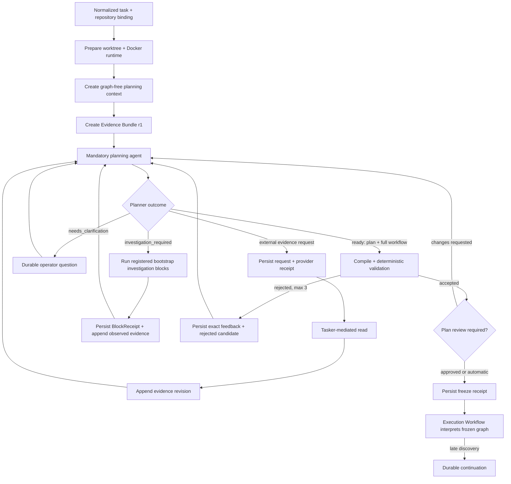

# Context, planning, and workflow freeze lifecycle

Status: **canonical implemented architecture**, 2026-08-10.

This document defines how Tasker goes from an admitted task to one immutable execution
workflow. No task graph exists before mandatory planning has enough evidence to propose
one.

## Lifecycle artifacts

```text
Bootstrap run
  -> planning context + Evidence Bundle
  -> planner workflow candidate
  -> frozen execution workflow
```

- **Bootstrap run** is a stable Temporal infrastructure workflow. It prepares the
  workspace and Docker runtime, coordinates evidence, questions, planning, validation,
  review, and freeze. It contains no bugfix, feature, translation, CI, or PR recipe.
- **Planning context** is an immutable schema-v8 snapshot of the task, repository
  locator, pinned harness, project policy, registered blocks, prompts, skills, and
  provider profiles. It deliberately contains no workflow graph.
- **Evidence Bundle** is an append-only, provenance-bearing record of observed task,
  repository, external-system, and investigation evidence.
- **Workflow candidate** is the complete task-specific source returned by the planner's
  `ready` decision. It is untrusted and cannot execute.
- **Frozen execution workflow** is the compiled candidate after deterministic
  validation, optional plan review, and an immutable freeze receipt.

Only the frozen workflow is input to the generic execution interpreter.

## End-to-end lifecycle



## Context and Evidence Bundle

Context discovery is intentionally bounded. It records the normalized task snapshot,
company/project workflow policy, repository identity and inventory, and relevant local
documents. It does not claim to understand the implementation or reproduce a bug.

Each Evidence Bundle entry records:

- evidence type and immutable identity;
- source kind and locator;
- capture time and observed source version, revision, or hash;
- content hash and media type;
- lifecycle phase and operation ID that introduced it.

New observations append a bundle revision; they never rewrite earlier evidence. Large
bodies and media remain separate content-addressed artifacts. Temporal history carries
only bounded references and hashes.

The planner receives the graph-free snapshot and materialized bundle. It retains its
pinned read-only repository skills so it can challenge shallow context discovery. Jira,
Confluence, Loop, Jenkins, and similar reads use Tasker's mediated evidence protocol:
the provider requests a declared skill/locator/purpose, Tasker persists that request and
provider receipt, performs the typed read, appends provenance, and invokes planning
again. Credentials never enter the provider session. At most three mediated evidence
rounds are accepted per planning attempt.

## Mandatory planner outcomes

Every task is planned even when operator plan review is automatic. The provider returns
one of three typed decisions:

1. `needs_clarification` — one or more human decisions materially affect scope,
   behavior, or acceptance. Automatic plan review never suppresses these questions.
2. `investigation_required` — an observable fact is required before an honest plan can
   be produced. The planner selects only registered blocks whose `availableDuring`
   includes `bootstrap_investigation`.
3. `ready` — the implementation plan, optional non-blocking follow-ups, and a complete
   task-specific execution workflow proposal. Each acceptance criterion contains an
   observable expectation and typed verification linked to the exact workflow step
   nodes that will prove it. A missing step reference rejects the whole decision.

When operator review is enabled, Cockpit presents the ready plan and its approve/revise
actions as one primary review surface. Plan prose is ordinary Markdown rendered without
raw HTML; graph node references remain diagnostic metadata rather than review copy. A
candidate rejected and then replaced during the same planning episode is projected as
an automatic correction, not as a current task failure. An unrecovered rejection remains
an error.

Plan review is a native Cockpit capability rather than an external annotation tool. The
operator can open the canonical Markdown document full-screen, select rendered text, attach
several comments, and submit them with optional overall guidance. Each review round is bound
to the immutable plan artifact ID and attempt, so Tasker rejects stale submissions instead of
applying them to a replacement plan. Draft annotations remain UI state; submitted rounds are
append-only ledger history. Temporal receives only the resulting `approve` decision or the
normalized `request_changes` guidance.

The provider boundary carries `decision` and `evidenceRequests` as direct structured
values. They are never JSON serialized inside string fields. Provider-only output
schemas may make optional workflow-node fields required and nullable when a subscription
CLI requires every declared property in `required`; the adapter removes those nulls
before validating the stricter domain decision. The domain plan and workflow contracts
do not inherit this transport concession.

Planning chooses whether verification reuses an existing automated test, creates a new
test during implementation, runs a registered project process, records runtime evidence,
or performs bounded inspection. No verification kind is mandatory for every task, and
there is no generic test-materialization block. For a reproduced bug, the planner can
combine a regression test with `bug.validate_fix@1`, which repeats the investigated
scenario after implementation.

An external evidence request is a provider protocol response, not a fourth planning
decision. The provider may not return a provisional decision while requesting evidence.

The planner selects from registered blocks; it does not invent a provider, model, skill,
step reference, command, or effect. Provider/model selection comes from a named,
snapshotted execution profile. Project blocks lacking required configuration, such as
an unconfigured process command, are absent from that run's planning catalog.

## Pre-plan investigation

Investigation is neither a hard-coded bug workflow nor part of the frozen execution
graph. A planner may request `bug.investigate@1` when reproduction evidence is needed,
or skip it when existing evidence is sufficient or the task is not a bug.

Bootstrap investigation uses the same generic block runner, provider profiles,
completion evaluator, durable receipts, Docker workspace, and operator-guidance waits
as ordinary agent work. The differences are explicit in the block contract:

- `availableDuring: ["bootstrap_investigation"]`;
- read-only/no product mutation effects;
- structured investigation output and authoritative completion evidence.

Completed investigation receipts are appended to the Evidence Bundle with provenance,
then the planner runs again. `before` reproduction media remains private Tasker evidence;
Tasker does not attach it to Jira. The frozen bug workflow normally contains only the
implementation and post-fix proof.

An exhausted Activity retry opens `investigation.retry@1` on the same Temporal run and
worktree. An agent uncertainty opens its typed `needs_input` wait. Neither condition
restarts intake or discards completed evidence.

## Candidate compilation and validation

A `ready` decision contains full workflow source, not an imperative patch. Tasker:

1. parses and compiles the complete candidate;
2. verifies references, typed inputs, capabilities, effects, reconciliation, bounded
   control flow, terminal paths, task obligations, and applicable policy obligations;
3. rejects bootstrap-only blocks appearing in execution;
4. persists exact validation errors and the rejected ready decision;
5. invokes the same planner again with `validationFeedback` and `previousDecision`.

There are at most three candidate revisions in one planning attempt. Tasker never
silently inserts missing steps, patches compiled IR, or executes a rejected candidate.
If those revisions are exhausted, invalid planner output becomes a typed blocked planning
result. Bootstrap opens one durable `planning.candidate-guidance@1` wait with the exact
validator reason instead of multiplying the same expensive planner command through
Temporal's infrastructure retry policy. Resume creates a new revision command carrying the
last rejected decision, accumulated validator feedback, and optional operator guidance;
completed workspace, context, evidence, and investigation remain unchanged. Failures
classified as transient may still use Activity retries.

Once accepted, Tasker persists the validated candidate, graph hash, and provider receipt
before creating the execution snapshot. This checkpoint is internal recovery state, not
another operator-visible stage. If snapshot materialization or its response path fails,
the same planning command resumes from the checkpoint and does not invoke the paid
planner again. Tasker then creates an execution snapshot containing only the referenced
execution blocks and their pinned prompts, skills, profiles, commands, policies, task,
workflow, workspace, and evidence reference.

## Plan review and freeze

Plan review is a per-run setting:

- `automatic` proceeds after deterministic validation;
- `required` waits for operator approval or revision guidance.

Revision guidance creates a new immutable planner command. The planner may ask another
question, request more evidence/investigation, or return a replacement plan and complete
candidate. The operator never edits compiled workflow state in place.

Freeze persists an idempotent receipt binding task, Temporal workflow/run, graph hash,
planning attempt and artifact, execution snapshot, Evidence Bundle revision, approval
mode, and timestamp. Activity redelivery returns the same receipt; a conflicting hash
fails closed. Only then does Bootstrap start Execution Workflow v2.

## Late discoveries

After freeze the active graph is immutable. An execution block that discovers another
repository, external process, or verification requirement returns a typed runtime
`workflow_change_required` proposal with durable evidence. Tasker validates a
continuation and preserves the completed parent prefix and worktree. It never edits the
accepted parent graph or restarts the Jira task.

Initial investigation/planning and runtime continuation are separate concepts:

- before freeze, the planner owns the first complete graph;
- after freeze, continuation extends completed work through a separately accepted
  graph/Child Workflow.

## Supported schemas and deleted path

Only Bootstrap v3, Execution v2, and planning/execution snapshot schema v8 are accepted.
The pre-planning graph assembler, draft-revision Activity, graph-bearing Generate input,
schema v7 reader, legacy bootstrap workflow, and their compatibility tests are deleted.
Development data created by those shapes is disposable and must be regenerated.
