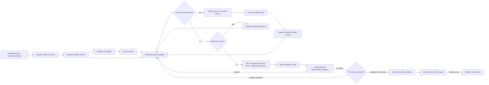

# Context, planning, and workflow freeze lifecycle

Status: **canonical target architecture**, 2026-08-09.

This document defines the boundary between context collection, task planning, graph
assembly, and execution. It supersedes any older statement that the first compiled
graph is immutable before implementation planning has completed.

## The three workflow states

```text
bootstrap workflow -> draft workflow -> frozen execution workflow
```

These names do not describe three reusable business templates:

- **bootstrap workflow** is the durable Tasker lifecycle that gathers evidence and
  coordinates assembly. It contains no bugfix, feature, translation, CI, or PR recipe;
- **draft workflow** is the first complete task-specific graph proposed from the
  collected evidence. It is a hypothesis and may be revised by planning;
- **frozen execution workflow** is the task-specific graph after planning proposals
  have been applied, recompiled, deterministically validated, and, when configured,
  approved by the operator.

Only the frozen execution workflow has the immutable-graph guarantee. A draft is never
executed for product effects.

## End-to-end lifecycle



Context discovery collects the minimum evidence needed to form a useful draft. It does
not decide the final implementation, claim reproduction, or exhaustively inspect every
linked system. The planning agent always runs and is allowed to challenge the draft.

## Evidence Bundle

The Evidence Bundle is append-only. Each addition records:

- evidence kind and immutable artifact reference;
- source adapter and source locator;
- capture time;
- source revision, ETag, updated timestamp, commit, or content hash;
- content hash and bounded summary;
- the lifecycle phase and agent/tool invocation that introduced it.

A new read creates a new evidence entry or bundle revision; it does not overwrite an
older observation. Bounded JSON/text evidence may live inside the immutable bundle
artifact; large Jira bodies, Confluence pages, Loop threads, repository files, and
attachments use separate artifacts referenced by entries. Temporal history contains
only the bundle reference and hashes.

The workflow assembler and planner consume the same bundle. The planner reads supplied
evidence first and may invoke only the read-only logical skills selected by its pinned
harness snapshot. A mediated skill invocation returns both its result and provenance so
Tasker can append it before accepting the planner decision. Provider transcripts are
observability evidence, but a transcript alone is not the canonical Evidence Bundle.

External planning skills are capability names, not provider-side API clients. For Jira,
Confluence, and Loop, Tasker replaces the workspace skill with a generated request-only
skill, removes the corresponding credential variables from the provider subprocess,
and performs the actual read in a typed adapter. The request, purpose, provider receipt,
token usage, and operation ID are persisted before the read. A worker/VPN failure thus
resumes the pending read without rerunning that planner round. At most three mediated
evidence rounds are accepted per planning attempt.

Bodies larger than 64 KiB are content-addressed `evidence_body` artifacts. The persisted
bundle entry contains their checksum reference; Tasker verifies and materializes the
body only when constructing planner input. This keeps Temporal history and the bundle
artifact bounded without hiding evidence in a provider transcript.

## Planning output

Planning is mandatory even when operator review is disabled. It returns exactly one
typed outcome:

- `ready`: an implementation plan that fits the draft;
- `needs_clarification`: blocking questions whose answers materially affect scope or
  behavior;
- `workflow_change_required`: a proposal explaining which graph obligations,
  repositories, capabilities, or verification paths must change.

`workflow_change_required` is never permission to mutate a graph directly. Tasker:

1. resolves and appends any additional evidence;
2. applies the proposal to the current draft through the workflow assembler;
3. recompiles the complete draft from source;
4. runs deterministic obligations and safety validation again;
5. records the accepted or rejected revision with its rationale.

During the pilot, accepted draft revisions remain visible to the operator. Whether the
final plan requires an explicit approval is a per-run setting. Validation is never
optional.

## Planning skills and effects

The planner is an agentic lifecycle phase, not a deterministic compiler pass. It keeps
read-only repository and context skills even when context discovery already ran. This
is intentional: the first collector produces a starting hypothesis, while planning
must be able to verify it, inspect deeper implementation details, and discover a missed
cross-repository dependency.

Planning must not receive product mutation capabilities. Jira writes, workspace writes,
commands with side effects, branch publication, CI starts, and PR mutation remain
execution blocks or explicit integration effects after graph freeze.

## Late discoveries

After freeze, the graph is immutable. A reproduction or implementation block that finds
an unplanned repository, external process, or verification requirement returns a typed
`workflow_change_required` result with durable evidence. Tasker creates a validated
continuation from the completed prefix. It never restarts the original task or discards
its worktree merely because the graph must grow.

Initial planning revisions and execution-time continuations are deliberately different:

- planning revises a draft before product effects begin;
- continuation preserves an already accepted graph and completed execution prefix.

## Migration status

As of 2026-08-09, Tasker persists a typed, append-only Evidence Bundle with provenance,
deduplicated immutable revisions, and restart-safe references. A dedicated Temporal
bootstrap Workflow now invokes context discovery and initial draft assembly through one
heartbeat-enabled Activity. The HTTP Generate action waits for that durable result;
repeated requests reuse an accepted draft, rejected drafts receive a new bootstrap
identity, and an exhausted transient failure can start a replacement run after the
infrastructure is restored. Temporal history receives only the bounded status and graph
hash; evidence and graph bodies remain Tasker artifacts.

Workflow analysis and implementation planning consume the same bundle. Planning
snapshots carry only the immutable initial bundle reference. The planner also receives
the block's snapshotted read-only skills and may inspect the read-only worktree; external
system reads must use the mediated request protocol and append a newer bundle revision.

The v4 kernel cutover removed planning lifecycle discovery together with the old
`taskWorkflow`. Bootstrap returns a typed frozen-workflow handoff; Execution accepts
that handoff directly and contains no planning-step or plan-gate names. Pre-v4 Workflow
histories are deleted development data, not a compatibility surface.

A planning `workflow_change_required` result invokes a heartbeat-enabled draft
revision Activity. That Activity resolves newly discovered repositories, appends
context evidence, asks the workflow analyzer for a complete replacement source,
recompiles and validates it through the ordinary M1 compiler, and records a new
immutable attempt. The accepted hash, graph, and planning-snapshot reference replace
the in-Workflow draft. The planner then checks the revised draft again. Three
automatic draft-revision cycles are allowed before a slot-free
`draft_revision.guidance@1` operator wait.

Draft revision has a stable operation ID persisted in the same ledger transaction as
the compiled attempt. If an Activity completion is lost, redelivery returns that exact
attempt without rerunning context discovery or the provider. Validation failure or
repository/VPN failure leaves the Temporal run and prepared workspace intact and opens
operator guidance after Activity retries are exhausted.

After planning and optional review, the lifecycle marks its graph nodes complete and
persists an immutable freeze receipt before handing the accepted graph/hash to the
generic interpreter. The receipt binds the task and Temporal run to the exact graph
hash, planning attempt and artifact, planning Evidence Bundle snapshot, approval mode,
and freeze time. Redelivery returns the same receipt; a different graph for the same
run is rejected. The public run state is explicitly `draft` until that Activity
completes and `frozen` afterwards. A ledger/VPN/infrastructure failure opens the durable
`workflow_freeze.retry@1` wait with the same run and prepared workspace instead of
restarting the task.

The execution traversal has no code path that replaces the frozen active graph. A
later execution-block `workflow_change_required` still opens continuation review and
may start a Child Workflow, preserving the original prefix.

The evidence boundary now mediates Jira, Confluence, and Loop reads through
provenance-producing Tasker adapters, persists pending requests before I/O, attributes
each planner round's usage, and externalizes large bodies. The next gates are the small
Execution Workflow kernel and authoritative block completion, followed by an
allowlisted real pilot through planning, frozen execution, PR/CI, and human review.
