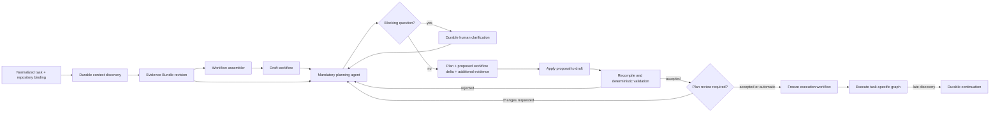

# Context, planning, and workflow freeze lifecycle

Status: **canonical target architecture**, 2026-08-05.

This document defines the boundary between context collection, task planning, graph
assembly, and execution. It supersedes any older statement that the first compiled
graph is immutable before implementation planning has completed.

## The three workflow states

```text
bootstrap workflow -> draft workflow -> frozen execution workflow
```

These names do not describe three reusable business templates:

- **bootstrap workflow** is the durable Tasker lifecycle that gathers evidence and
  coordinates assembly. It contains no bugfix, feature, translation, CI, or PR recipe;
- **draft workflow** is the first complete task-specific graph proposed from the
  collected evidence. It is a hypothesis and may be revised by planning;
- **frozen execution workflow** is the task-specific graph after planning proposals
  have been applied, recompiled, deterministically validated, and, when configured,
  approved by the operator.

Only the frozen execution workflow has the immutable-graph guarantee. A draft is never
executed for product effects.

## End-to-end lifecycle



Context discovery collects the minimum evidence needed to form a useful draft. It does
not decide the final implementation, claim reproduction, or exhaustively inspect every
linked system. The planning agent always runs and is allowed to challenge the draft.

## Evidence Bundle

The Evidence Bundle is append-only. Each addition records:

- evidence kind and immutable artifact reference;
- source adapter and source locator;
- capture time;
- source revision, ETag, updated timestamp, commit, or content hash;
- content hash and bounded summary;
- the lifecycle phase and agent/tool invocation that introduced it.

A new read creates a new evidence entry or bundle revision; it does not overwrite an
older observation. Bounded JSON/text evidence may live inside the immutable bundle
artifact; large Jira bodies, Confluence pages, Loop threads, repository files, and
attachments use separate artifacts referenced by entries. Temporal history contains
only the bundle reference and hashes.

The workflow assembler and planner consume the same bundle. The planner reads supplied
evidence first and may invoke only the read-only logical skills selected by its pinned
harness snapshot. A mediated skill invocation returns both its result and provenance so
Tasker can append it before accepting the planner decision. Provider transcripts are
observability evidence, but a transcript alone is not the canonical Evidence Bundle.

## Planning output

Planning is mandatory even when operator review is disabled. It returns exactly one
typed outcome:

- `ready`: an implementation plan that fits the draft;
- `needs_clarification`: blocking questions whose answers materially affect scope or
  behavior;
- `workflow_change_required`: a proposal explaining which graph obligations,
  repositories, capabilities, or verification paths must change.

`workflow_change_required` is never permission to mutate a graph directly. Tasker:

1. resolves and appends any additional evidence;
2. applies the proposal to the current draft through the workflow assembler;
3. recompiles the complete draft from source;
4. runs deterministic obligations and safety validation again;
5. records the accepted or rejected revision with its rationale.

During the pilot, accepted draft revisions remain visible to the operator. Whether the
final plan requires an explicit approval is a per-run setting. Validation is never
optional.

## Planning skills and effects

The planner is an agentic lifecycle phase, not a deterministic compiler pass. It keeps
read-only repository and context skills even when context discovery already ran. This
is intentional: the first collector produces a starting hypothesis, while planning
must be able to verify it, inspect deeper implementation details, and discover a missed
cross-repository dependency.

Planning must not receive product mutation capabilities. Jira writes, workspace writes,
commands with side effects, branch publication, CI starts, and PR mutation remain
execution blocks or explicit integration effects after graph freeze.

## Late discoveries

After freeze, the graph is immutable. A reproduction or implementation block that finds
an unplanned repository, external process, or verification requirement returns a typed
`workflow_change_required` result with durable evidence. Tasker creates a validated
continuation from the completed prefix. It never restarts the original task or discards
its worktree merely because the graph must grow.

Initial planning revisions and execution-time continuations are deliberately different:

- planning revises a draft before product effects begin;
- continuation preserves an already accepted graph and completed execution prefix.

## Current implementation gap

As of 2026-08-05, Tasker persists a typed, append-only Evidence Bundle with provenance,
deduplicated immutable revisions, and restart-safe references. Workflow analysis and
implementation planning consume that same bundle; neither provider performs its own
hidden repository evidence collection. Planning snapshots carry only the immutable
bundle reference. The planner also receives the block's snapshotted read-only skills.

Tasker still compiles the graph before Temporal execution begins and special-cases
`task.analyze@1` inside the graph interpreter. The following target work remains:

1. move context discovery and draft assembly into the durable bootstrap lifecycle;
2. mediate Jira/Confluence/Loop skill reads through provenance-producing Tasker
   adapters and move large evidence bodies into separately referenced artifacts;
3. treat planning workflow changes as draft proposals followed by full recompilation,
   rather than ordinary execution continuation;
4. freeze and start the execution graph only after plan-fit validation and optional
   review;
5. remove the interpreter's name-based `task.analyze@1` special case once planning is a
   first-class lifecycle phase.

No new execution block should depend on the old special case as a permanent extension
surface.
