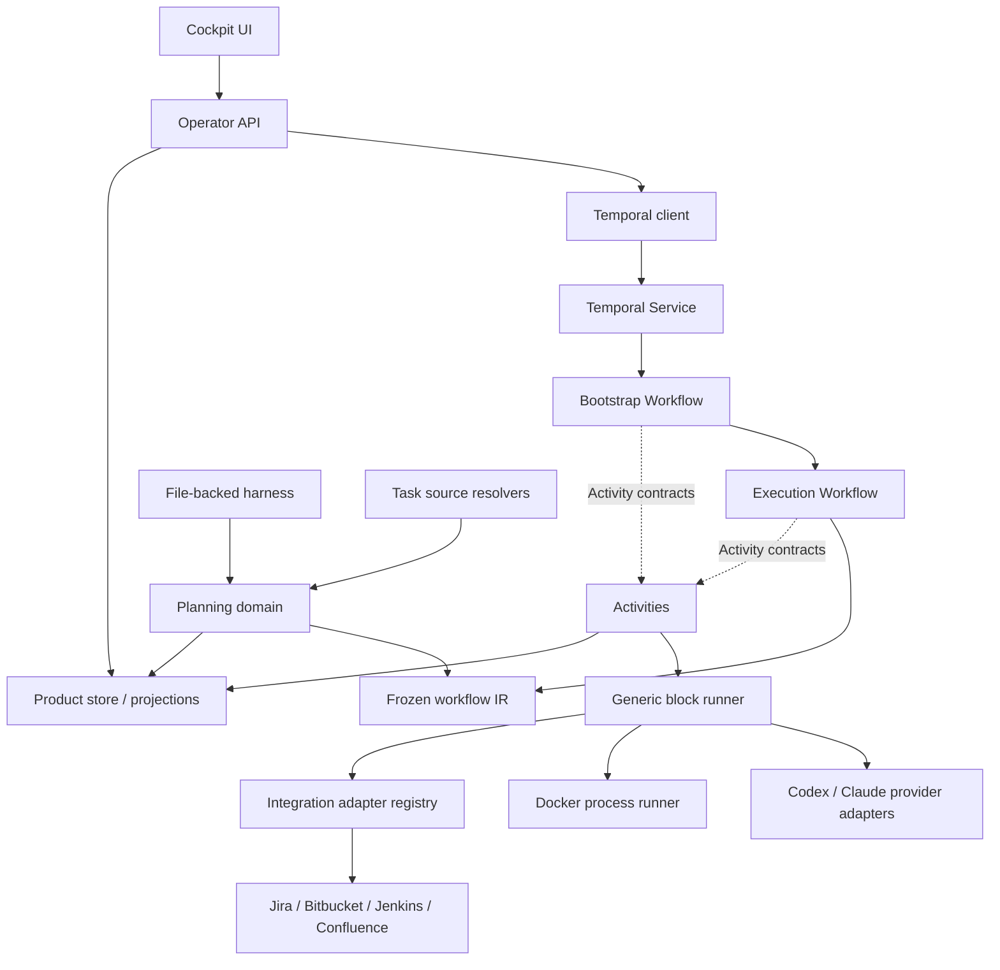

# Tasker technical architecture

Status: canonical implementation map, 2026-08-13

This document maps the architecture to concrete files. It intentionally distinguishes
the durable core from the product shell and from external adapters.

## 1. What the core is

Tasker's durable core is not “all application code”, and it is not the Temporal SDK by
itself. It consists of two small deterministic domains hosted by Temporal:

1. the workflow IR, compiler, and validator under [`src/workflow`](../../src/workflow);
2. the Bootstrap and Execution Workflows plus their message/state contracts under
   [`src/temporal/bootstrap-kernel`](../../src/temporal/bootstrap-kernel),
   [`src/temporal/execution-kernel`](../../src/temporal/execution-kernel), and
   [`src/temporal/workflows`](../../src/temporal/workflows).

The Execution Workflow only traverses a frozen graph. It does not know Jira,
Bitbucket, Jenkins, Confluence, Git, Docker, Codex, Claude, SQLite, prompts, or company
policy. Bootstrap is also deterministic, but it owns the durable preparation protocol:
workspace, context, planning/investigation, optional plan review, freeze, and starting
the child Execution Workflow.

Everything that performs I/O runs in a Temporal Activity or in the API/product shell.
Temporal remains the only authority for execution position, retries, waits, and
recovery. SQLite stores product artifacts and read models; it is not a scheduler.

The repository enforces these claims in
[`test/unit/architecture-boundaries.test.ts`](../../test/unit/architecture-boundaries.test.ts).
That test fails if workflow/kernel code imports the control plane or external adapters.

## 2. Dependency direction



The solid arrows are normal module/runtime dependencies. The dotted Activity edges are
Temporal scheduling boundaries: Workflow code calls typed Activity interfaces, never
the implementation that performs I/O.

Concrete adapters are chosen only at two composition roots:

- [`src/control-plane/operator-server.ts`](../../src/control-plane/operator-server.ts)
  wires the operator API, task-source resolvers, evidence readers, planning coordinator,
  Temporal client, and product stores;
- [`src/temporal/worker-main.ts`](../../src/temporal/worker-main.ts) wires Activity
  implementations, provider/process runners, workspace services, and configured
  integration adapters into the Temporal worker.

These files are intentionally allowed to be vendor-aware. Moving to GitLab Issues or a
different CI provider changes a resolver/adapter and these composition roots, not the
workflow interpreter.

## 3. End-to-end path: task to code-review wait

### 3.1 Task source and generation subject

The API accepts a neutral `taskReference`. The current Jira import/sync surface lives in
[`src/integrations/jira/service.ts`](../../src/integrations/jira/service.ts). Jira is
converted into the neutral planning boundary by
[`src/integrations/jira/workflow-generation-subject.ts`](../../src/integrations/jira/workflow-generation-subject.ts).

The boundary itself is
[`src/planning/generation-subject.ts`](../../src/planning/generation-subject.ts):

- `WorkflowGenerationSubject` contains the normalized task, repository path, and opaque
  source snapshot;
- `WorkflowGenerationSubjectResolver` is the port implemented by a task source;
- `WorkflowGenerationSubjectSource` asks registered resolvers in order and fails closed
  when no source owns the reference.

[`src/control-plane/persisted-generation-subject.ts`](../../src/control-plane/persisted-generation-subject.ts)
provides two distinct persistence roles. Continuation tasks can have an explicitly
persisted source subject; every bootstrap run also captures its resolved subject under
the exact Temporal `runId`. Retries and process restarts read that run capture first,
while a later run of the same Jira task resolves and captures a fresh source revision.
Adding GitLab Issues means adding a second resolver that produces the same neutral
contract.

### 3.2 Starting the durable lifecycle

HTTP commands are defined in
[`src/control-plane/operator-api.ts`](../../src/control-plane/operator-api.ts). The API
does not execute a graph. It validates the command and calls the service in
[`src/temporal/client.ts`](../../src/temporal/client.ts).

Every mutation carries the expected current `runId`. A stale browser or previous run
cannot resume, approve, or restart another run. The bootstrap workflow ID is the
task-level lifecycle identity; the exact Temporal run ID scopes mutable planning,
evidence, freeze, and execution artifacts.

### 3.3 Bootstrap Workflow

[`src/temporal/workflows/bootstrap-workflow-v3.ts`](../../src/temporal/workflows/bootstrap-workflow-v3.ts)
is the durable bootstrap state machine. Its stages are protocol boundaries, not a
company workflow template:

1. `prepareTaskWorkspace` creates/reconciles the managed worktree and Docker runtime;
2. `assembleTaskPlanningContext` persists a graph-free planning snapshot and Evidence
   Bundle;
3. `planTaskImplementation` runs the mandatory planner;
4. `runBootstrapInvestigation` executes only planner-requested, registered read-only
   investigation blocks, then returns evidence to the same planning episode;
5. `plan_review` waits only when the run requested operator review;
6. `freezeTaskWorkflow` persists the accepted immutable graph and planning receipt;
7. Bootstrap starts `executionWorkflowV2` as a child and waits for its result.

The Workflow uses only the contracts in
[`src/temporal/bootstrap-kernel/contracts.ts`](../../src/temporal/bootstrap-kernel/contracts.ts)
and messages in
[`src/temporal/bootstrap-kernel/messages.ts`](../../src/temporal/bootstrap-kernel/messages.ts).
Failures open durable waits and retry only the pending boundary; completed work and the
worktree are preserved.

Preparation Activities persist their detailed worktree, harness, Docker, and provider
receipts outside Event History. The Workflow receives only neutral handles and bounded
artifact references. This keeps environment variables, command output, vendor response
shapes, and large manifests out of the durable protocol.

### 3.4 Context and planning

The Activity bridge lives in [`src/temporal/activities`](../../src/temporal/activities):

- [`workspace-activity.ts`](../../src/temporal/activities/workspace-activity.ts) calls
  neutral subject/workspace/runtime-policy ports;
- [`bootstrap-context-assembly-activity.ts`](../../src/temporal/activities/bootstrap-context-assembly-activity.ts)
  calls the graph-free context assembler;
- [`planning-activity.ts`](../../src/temporal/activities/planning-activity.ts) calls the
  planning coordinator and records provider progress;
- [`bootstrap-investigation-activity.ts`](../../src/temporal/activities/bootstrap-investigation-activity.ts)
  runs selected investigation steps;
- [`workflow-freeze-activity.ts`](../../src/temporal/activities/workflow-freeze-activity.ts)
  persists the immutable freeze receipt.

Planning application services live in [`src/control-plane`](../../src/control-plane)
because they persist artifacts and invoke providers. The actual planning domain is in
[`src/planning`](../../src/planning):

- [`task-snapshot.ts`](../../src/planning/task-snapshot.ts) is the vendor-neutral task
  contract;
- [`analyzer-context.ts`](../../src/planning/analyzer-context.ts) exposes only applicable
  harness blocks and policy to the agent;
- [`implementation-plan.ts`](../../src/planning/implementation-plan.ts) defines the typed
  plan, questions, criteria, and verification references;
- [`proposal.ts`](../../src/planning/proposal.ts) parses the untrusted workflow proposal;
- [`planner.ts`](../../src/planning/planner.ts) compiles it and applies generic
  obligations;
- [`obligations.ts`](../../src/planning/obligations.ts) contains vendor-neutral structural
  safety checks. Company ordering belongs in file-backed policies, not here.

The planner may choose any registered step and control-flow node. It cannot invent a
step type, capability, wait, predicate, provider profile, or adapter. A rejected
candidate is returned to the same planner with exact validator feedback; Tasker never
patches the graph silently.

### 3.5 Workflow IR, compiler, and freeze

[`src/workflow/schema.ts`](../../src/workflow/schema.ts) defines the only graph IR:
sequence, step, branch, bounded loop, wait, gate, and finalize. The source graph is
untrusted JSON. [`src/workflow/compiler.ts`](../../src/workflow/compiler.ts) validates
references, control flow, bounds, capabilities, effects, terminal paths, and contracts,
then produces the canonical hash-bearing compiled graph.

The compiler knows contracts, not Jira or particular step names. Loaded harness
manifests supply step/predicate/wait registries through
[`src/planning/contracts.ts`](../../src/planning/contracts.ts). The immutable run
snapshot and freeze receipt are persisted before execution starts.

### 3.6 Execution Workflow

[`src/temporal/workflows/execution-workflow-v2.ts`](../../src/temporal/workflows/execution-workflow-v2.ts)
is the generic interpreter. Its switch handles only IR node kinds:

- `sequence`: execute children in order;
- `step`: schedule one block Activity and accept only a completed receipt;
- `branch`: evaluate a registered predicate and skip the other subtree;
- `bounded_loop`: repeat within the frozen limit, then open a durable guidance wait;
- `wait` / `gate`: suspend on a typed operator/external resolution;
- `finalize`: return the declared terminal outcome.

Execution state and messages live in
[`src/temporal/execution-kernel`](../../src/temporal/execution-kernel). The interpreter
has no step-name switch and no external-system imports.

### 3.7 Block execution and external systems

[`src/temporal/activities/block-execution.ts`](../../src/temporal/activities/block-execution.ts)
is the generic Activity-side block host. For every step it:

1. loads the exact frozen planning snapshot;
2. resolves the snapshotted block definition and validates its typed input;
3. invokes exactly one executor kind: agent, configured process, or integration port;
4. persists candidate output and independently gathers declared evidence;
5. evaluates Block Definition v3 and persists Block Receipt v4;
6. records an idempotent Block Receipt with predicate facts;
7. returns `completed` only for an accepted receipt, otherwise a durable wait reason.

External adapter ports and the registry are in
[`src/integrations/execution.ts`](../../src/integrations/execution.ts). Concrete
implementations live below [`src/integrations`](../../src/integrations): Jira lifecycle,
Bitbucket PR/review, and Jenkins observation. The worker registers only configured and
authorized adapters. An unavailable adapter pauses that selected step; it does not add
logic to the interpreter.

## 4. Where workflow behavior is configured

The complete production step catalog is file-backed under
[`harness/steps`](../../harness/steps). One package owns one configurable unit of work:

```text
harness/steps/<name>/
  step.json   # identity, stage, executor, contract, effects, evidence, recovery
  prompt.md   # only for agent steps
```

[`src/harness/loader.ts`](../../src/harness/loader.ts) validates and loads those
packages. [`src/harness/step-contracts.ts`](../../src/harness/step-contracts.ts) is the
typed runtime ABI for named payload shapes; it cannot register a step by itself.

Other extension surfaces are:

- [`harness/company.json`](../../harness/company.json): provider/model profiles, routing,
  capabilities, Docker defaults, and company facts;
- [`harness/projects`](../../harness/projects): repository-specific workflow facts,
  commands, services, translation/publication mode, and validation policy;
- [`harness/policies`](../../harness/policies): optional company obligations and skill
  bindings applied to existing steps;
- [`harness/prompts`](../../harness/prompts): the mandatory planner and continuation
  analyzer prompts;
- [`harness/workspace`](../../harness/workspace): the versioned skills/config pack
  materialized into managed worktrees.

Changing a prompt, skill selection, profile, command, or policy affects future frozen
runs. Adding a new agent step normally adds one `step.json` and `prompt.md`. TypeScript
changes are needed only for a new payload ABI, executor kind, or external adapter.

## 5. Persistence and authority

| State | Authority | Concrete files |
|---|---|---|
| current node, retry, loop, timer, wait | Temporal history | `src/temporal/workflows/*` |
| operator resume/approval command | Temporal Update scoped to expected run | `src/temporal/*-kernel/messages.ts`, `src/temporal/client.ts` |
| run-scoped task snapshot, evidence, plan, graph, receipts, transcripts | SQLite product store | `src/ledger`, `src/control-plane/*-store.ts`, Activity stores |
| task list/activity/workflow rail | disposable projection | `src/control-plane/operator-*-projection.ts` |
| managed checkout and runtime | reconciled Activity resource | `src/workspaces`, workspace Activities |
| external mutation outcome | reconciled effect receipt plus remote observation | `src/integrations/effects.ts`, concrete integration adapters |

The API first reads the current Temporal lifecycle and then resolves only artifacts
whose identifiers belong to that exact run. Bootstrap task-source resolution follows
the same rule: the immutable subject is captured by `taskReference + runId`, never by
Jira key alone. There is no “latest artifact by Jira key” fallback. A missing current
artifact fails closed instead of leaking state from an old run.

Detailed provider and runtime receipts remain owned by Activities and product stores.
Temporal history carries a neutral workspace handle plus artifact IDs, hashes, bounded
status, and decisions; it does not duplicate Docker receipts, provider payloads, or
transcripts.

## 6. Replaceability test

Replacing Jira with GitLab Issues requires:

1. a GitLab source service and `WorkflowGenerationSubjectResolver`;
2. optional GitLab lifecycle integration step packages and adapters;
3. a GitLab origin variant in the operator task projection and its Cockpit presentation;
4. composition-root registration;
5. company/project policy updates and adapter contract tests.

It does not require changes to `src/workflow`, either Temporal Workflow, the block
receipt evaluator, or existing provider/process execution.

The current operator task-list contract in
[`src/control-plane/operator-contracts.ts`](../../src/control-plane/operator-contracts.ts)
has only a Jira origin variant. That is deliberate product-surface code, not a claim
that the planning or execution core is Jira-specific. A second tracker extends this
discriminated union and the corresponding Cockpit details view while continuing to
produce the same neutral `WorkflowGenerationSubject`.

Replacing Jenkins is the same shape: bind `ci.observe@1` to another adapter that emits
the declared provider-neutral output predicates. Replacing Codex with Claude is an
execution-profile/configuration choice behind the existing provider contract.

## 7. Deliberate non-core product code

The following code is necessary, but it is not the durable kernel:

- [`src/control-plane`](../../src/control-plane): HTTP application service, artifact
  persistence, planning coordination, and operator projections;
- [`src/cockpit`](../../src/cockpit): the operator console;
- [`src/providers`](../../src/providers): subscription CLI invocation and normalization;
- [`src/workspaces`](../../src/workspaces): managed Git and Docker resources;
- [`src/repositories`](../../src/repositories): repository catalog and cloning;
- [`src/observability`](../../src/observability): usage, transcripts, and debug bundles;
- [`src/integrations`](../../src/integrations): external-system connections.

Their size does not make them execution authorities. The architectural test is whether
they can be replaced without changing graph traversal and whether retries resume from
Temporal's durable boundary. Current code satisfies the import boundary; the remaining
pilot work is to prove the configured real adapters and recovery behavior end to end.
